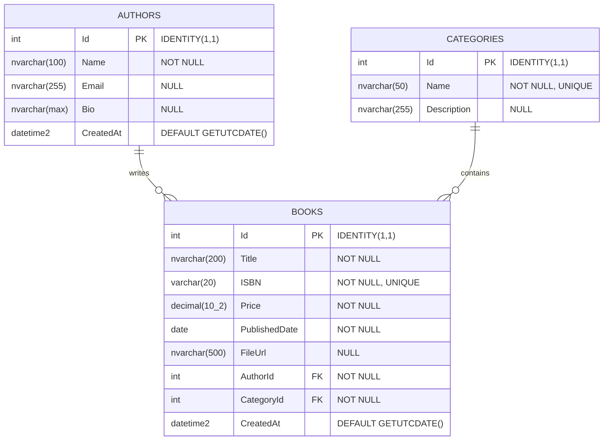
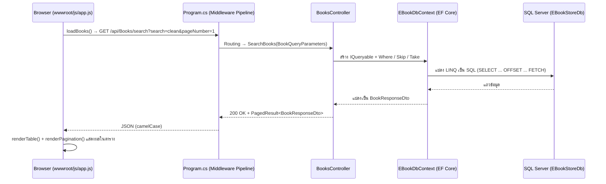
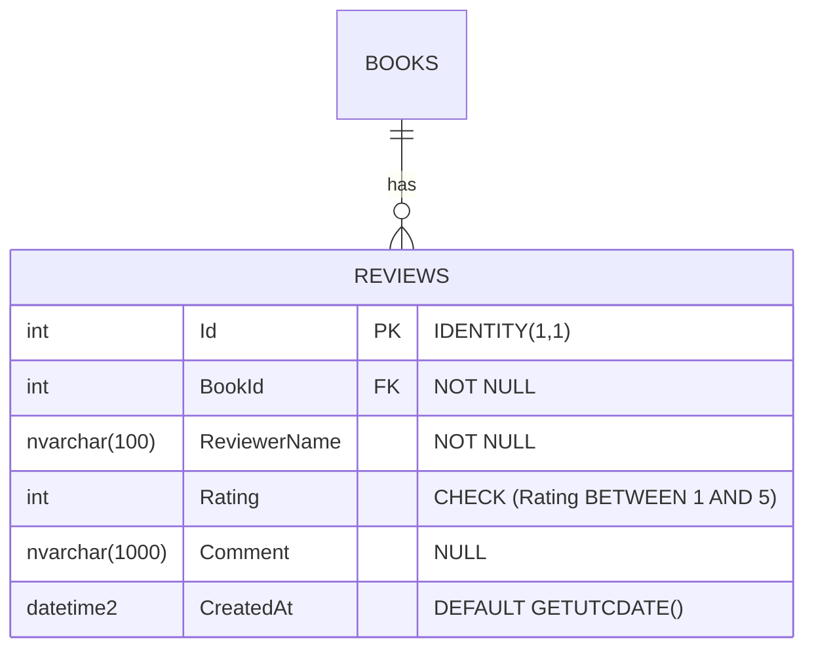

# หลักสูตรอบรมระยะสั้น 8 ชั่วโมง (1 วัน)
# การเชื่อมต่อฐานข้อมูล MS SQL Server ด้วย .NET 8 Core (C#) และการทำ CRUD (ระบบ E-Book Store API)

---

## สารบัญ (Table of Contents)
1. [ภาพรวมหลักสูตร (Course Overview)](#1-ภาพรวมหลักสูตร-course-overview)
   - [1.1 วัตถุประสงค์ (Objectives)](#11-วัตถุประสงค์-objectives)
   - [1.2 กลุ่มเป้าหมาย (Target Audience)](#12-กลุ่มเป้าหมาย-target-audience)
   - [1.3 ความรู้พื้นฐานที่ต้องมี (Prerequisites)](#13-ความรู้พื้นฐานที่ต้องมี-prerequisites)
   - [1.4 เครื่องมือและสภาพแวดล้อมที่ใช้ (Tools & Environment)](#14-เครื่องมือและสภาพแวดล้อมที่ใช้-tools--environment)
   - [1.5 ลิงก์ดาวน์โหลดและขั้นตอนการติดตั้ง (Installation Guide)](#15-ลิงก์ดาวน์โหลดและขั้นตอนการติดตั้ง-installation-guide)
2. [ตารางเวลาและแผนการสอน 8 ชั่วโมง (Course Schedule & Modules)](#2-ตารางเวลาและแผนการสอน-8-ชั่วโมง-course-schedule--modules)
3. [การออกแบบฐานข้อมูลระบบ E-Book (Database Design)](#3-การออกแบบฐานข้อมูลระบบ-e-book-database-design)
4. [เวิร์กช็อปแบบทีละขั้นตอน (Step-by-Step Workshop)](#4-เวิร์กช็อปแบบทีละขั้นตอน-step-by-step-workshop)
   - [4.1 สร้างโปรเจกต์ ASP.NET Core Web API](#41-สร้างโปรเจกต์-aspnet-core-web-api)
     - [4.1.1 โครงสร้างโปรเจกต์ (Project Structure)](#411-โครงสร้างโปรเจกต์-project-structure)
   - [4.2 การตั้งค่า Connection String ใน appsettings.json](#42-การตั้งค่า-connection-string-ใน-appsettingsjson)
   - [4.3 ส่วนที่ 1: ADO.NET ด้วย Microsoft.Data.SqlClient](#43-ส่วนที่-1-adonet-ด้วย-microsoftdatasqlclient)
   - [4.4 ส่วนที่ 2: Entity Framework Core (EF Core 8)](#44-ส่วนที่-2-entity-framework-core-ef-core-8)
   - [4.5 DTOs, Model Validation และการจัดการ Error](#45-dtos-model-validation-และการจัดการ-error)
   - [4.6 การทดสอบ API ด้วย Swagger และไฟล์ .http](#46-การทดสอบ-api-ด้วย-swagger-และไฟล์-http)
   - [4.7 ฟีเจอร์เสริม: การค้นหา กรองข้อมูล และ Pagination](#47-ฟีเจอร์เสริม-การค้นหา-กรองข้อมูล-และ-pagination)
   - [4.8 Frontend: หน้าเว็บจัดการ E-Book (HTML + JavaScript + Bootstrap 5)](#48-frontend-หน้าเว็บจัดการ-e-book-html--javascript--bootstrap-5)
5. [แบบฝึกหัดท้ายบทและ Mini Project ท้ายวัน (Exercises & Mini Project)](#5-แบบฝึกหัดท้ายบทและ-mini-project-ท้ายวัน-exercises--mini-project)
6. [ตารางเปรียบเทียบ ADO.NET vs Dapper vs EF Core](#6-ตารางเปรียบเทียบ-adonet-vs-dapper-vs-ef-core)
7. [ปัญหาที่พบบ่อยและแนวทางแก้ไข (Troubleshooting & FAQs)](#7-ปัญหาที่พบบ่อยและแนวทางแก้ไข-troubleshooting--faqs)
8. [สรุปท้ายหลักสูตร Cheat Sheet และแหล่งศึกษาต่อ (Summary & Cheat Sheet)](#8-สรุปท้ายหลักสูตร-cheat-sheet-และแหล่งศึกษาต่อ-summary--cheat-sheet)

---

## 1. ภาพรวมหลักสูตร (Course Overview)

### 1.1 วัตถุประสงค์ (Objectives)
- เข้าใจหลักการและสถาปัตยกรรมการเชื่อมต่อฐานข้อมูล Microsoft SQL Server บน .NET 8 (C#)
- สามารถใช้งาน **ADO.NET (`Microsoft.Data.SqlClient`)** เพื่อทำความเข้าใจการส่งคำสั่ง SQL ดิบ, Connection Lifecycle และการป้องกันช่องโหว่ **SQL Injection** ด้วย Parameterized Query
- สามารถประยุกต์ใช้ **Entity Framework Core 8 (EF Core 8)** ในรูปแบบ Code-First เพื่อสร้าง Model, DbContext, Migrations และการทำ CRUD แบบ Asynchronous
- เข้าใจการออกแบบ API ตามมาตรฐานสากล: การใช้ DTO (Data Transfer Objects), Validation, Error Handling และการจัดการ Pagination
- สามารถพัฒนา **Frontend Web UI** เชื่อมต่อกับ Web API ได้อย่างสมบูรณ์ ด้วย HTML5, JavaScript (Fetch API async/await) และ Bootstrap 5 พร้อมเข้าใจการเสิร์ฟ Static Files และการจัดการ CORS
- มีทักษะการตรวจสอบและแก้ปัญหา connection strings, SSL certificates, migration conflicts และการเชื่อมต่อข้าม origin

### 1.2 กลุ่มเป้าหมาย (Target Audience)
- นักพัฒนาโปรแกรมระดับเริ่มต้นถึงระดับกลาง (Junior to Mid-level .NET Developers)
- โปรแกรมเมอร์ที่ย้ายมาจากภาษาอื่น (Node.js, Java, PHP, Python) และต้องการพัฒนา RESTful API ด้วย C# และ SQL Server
- นักศึกษาและผู้ที่ต้องการเสริมทักษะ Backend Development สาย Microsoft Stack

### 1.3 ความรู้พื้นฐานที่ต้องมี (Prerequisites)
- พื้นฐานภาษา C# (Data types, Classes, Methods, LINQ เบื้องต้น, `async/await`)
- พื้นฐานคำสั่ง SQL (SELECT, INSERT, UPDATE, DELETE, WHERE, JOIN)
- ความเข้าใจพื้นฐานเกี่ยวกับ RESTful API (HTTP Methods: GET, POST, PUT, DELETE, Status Codes)

### 1.4 เครื่องมือและสภาพแวดล้อมที่ใช้ (Tools & Environment)
1. **.NET 8 SDK** (ตรวจสอบด้วย `dotnet --version` หรือ `dotnet --list-sdks`)
2. **Microsoft SQL Server 2022** (SQL Server Express / Developer หรือรันผ่าน Docker Container)
3. **Database Management Tool**: SQL Server Management Studio (SSMS) หรือ Visual Studio Code พร้อมส่วนขยาย MSSQL extension *(หมายเหตุ: Azure Data Studio ถูกประกาศยุติการพัฒนา (retired) แล้ว แนะนำให้ใช้ SSMS หรือ VS Code + MSSQL extension แทน)*
4. **Code Editor / IDE**: Visual Studio 2022 (Community Edition ขึ้นไป) หรือ Visual Studio Code (พร้อมส่วนขยาย C# Dev Kit และ REST Client)
5. **API Testing Tool**: Swagger UI (Built-in) หรือ Visual Studio Code REST Client (`.http` file)

---

### 1.5 ลิงก์ดาวน์โหลดและขั้นตอนการติดตั้ง (Installation Guide)

#### ตารางลิงก์ดาวน์โหลดเครื่องมือ (Download Links Table)

| ชื่อเครื่องมือ | ใช้ทำอะไร | ลิงก์ดาวน์โหลด / เอกสาร | จำเป็น / ทางเลือก |
| :--- | :--- | :--- | :---: |
| **.NET 8 SDK** | ชุดพัฒนาหลักและ Runtime สำหรับ C# และ ASP.NET Core Web API | [https://dotnet.microsoft.com/download/dotnet/8.0](https://dotnet.microsoft.com/download/dotnet/8.0) | **จำเป็น (Required)** |
| **Microsoft SQL Server 2022** (Developer / Express) | ระบบจัดการฐานข้อมูลเชิงสัมพันธ์ (RDBMS) ติดตั้งลงเครื่อง Windows โดยตรง | [https://www.microsoft.com/sql-server/sql-server-downloads](https://www.microsoft.com/sql-server/sql-server-downloads) | **จำเป็น\*** (เลือกติดตั้งตรง หรือผ่าน Docker) |
| **SQL Server on Docker** (Quickstart Guide) | คู่มือการติดตั้งและคอนฟิกรัน SQL Server 2022 บน Docker Container | [https://learn.microsoft.com/sql/linux/quickstart-install-connect-docker](https://learn.microsoft.com/sql/linux/quickstart-install-connect-docker) | **ทางเลือก\*** (แนะนำสำหรับ macOS / Linux / ผู้ใช้ Docker) |
| **Docker Desktop** | แพลตฟอร์ม Container สำหรับรัน SQL Server บน Docker | [https://www.docker.com/products/docker-desktop/](https://www.docker.com/products/docker-desktop/) | **ทางเลือก** (จำเป็นหากเลือกใช้ Docker) |
| **SQL Server Management Studio (SSMS)** | เครื่องมือ GUI ทางการสำหรับจัดการ ออกแบบตาราง และรันคำสั่ง SQL | [https://learn.microsoft.com/sql/ssms/download-sql-server-management-studio-ssms](https://learn.microsoft.com/sql/ssms/download-sql-server-management-studio-ssms) | **แนะนำ** (สำหรับ Windows หากไม่ใช้ VS Code) |
| **Visual Studio 2022** (Community Edition ขึ้นไป) | IDE ตัวเต็มสำหรับพัฒนา .NET พัฒนาและดีบักได้อย่างครบวงจร | [https://visualstudio.microsoft.com/downloads/](https://visualstudio.microsoft.com/downloads/) | **ทางเลือก\*\*** (เลือกใช้ VS หรือ VS Code) |
| **Visual Studio Code (VS Code)** | Code Editor ขนาดเล็ก ยืดหยุ่นสูง รองรับทุกแพลตฟอร์ม | [https://code.visualstudio.com/](https://code.visualstudio.com/) | **ทางเลือก\*\*** (เลือกใช้ VS หรือ VS Code) |
| **C# Dev Kit** (Extension สำหรับ VS Code) | ส่วนขยายทางการจาก Microsoft เพิ่ม Solution Explorer, IntelliSense และ Test Runner | [https://marketplace.visualstudio.com/items?itemName=ms-dotnettools.csdevkit](https://marketplace.visualstudio.com/items?itemName=ms-dotnettools.csdevkit) | **จำเป็น** (หากเลือกใช้ VS Code) |
| **MSSQL extension for VS Code** | ส่วนขยายจัดการฐานข้อมูลและเขียนคิวรี T-SQL บน VS Code *(ใช้แทน Azure Data Studio)* | [https://marketplace.visualstudio.com/items?itemName=ms-mssql.mssql](https://marketplace.visualstudio.com/items?itemName=ms-mssql.mssql) | **แนะนำ** (หากเลือกใช้ VS Code) |
| **REST Client** (Extension สำหรับ VS Code) | ส่ง HTTP Request เพื่อทดสอบ Web API โดยตรงผ่านไฟล์ `.http` | [https://marketplace.visualstudio.com/items?itemName=humao.rest-client](https://marketplace.visualstudio.com/items?itemName=humao.rest-client) | **แนะนำ** (หากเลือกใช้ VS Code) |
| **dotnet-ef CLI Tool** | เครื่องมือ Command-line สำหรับจัดการ Entity Framework Core Migrations | [https://learn.microsoft.com/ef/core/cli/dotnet](https://learn.microsoft.com/ef/core/cli/dotnet) | **จำเป็น (Required)** |
| **Git** | ระบบ Version Control สำหรับจัดการ Source Code และโคลนโปรเจกต์ | [https://git-scm.com/downloads](https://git-scm.com/downloads) | **แนะนำ (Recommended)** |

> [!NOTE]
> **หมายเหตุสำคัญเกี่ยวกับ Azure Data Studio (Retired):**
> ปัจจุบัน **Azure Data Studio ถูกยุติการพัฒนา (retired)** โดย Microsoft แล้ว จึงขอแนะนำให้ผู้เรียนใช้งาน **SQL Server Management Studio (SSMS)** สำหรับ Windows หรือใช้งาน **Visual Studio Code ร่วมกับส่วนขยาย MSSQL extension** แทน ซึ่งรองรับการเชื่อมต่อ ดูโครงสร้างฐานข้อมูล และรันคิวรี T-SQL ได้อย่างสมบูรณ์

---

#### ขั้นตอนการติดตั้งและคำสั่งตรวจสอบหลังติดตั้ง (Installation Steps & Verification)

##### 1. ติดตั้ง .NET 8 SDK
1. ดาวน์โหลดตัวติดตั้ง **.NET 8 SDK (x64)** สำหรับ Windows จาก [https://dotnet.microsoft.com/download/dotnet/8.0](https://dotnet.microsoft.com/download/dotnet/8.0)
2. รันไฟล์ติดตั้ง `.exe` และคลิก **Install** จนเสร็จสมบูรณ์
3. ตรวจสอบการติดตั้งผ่าน Terminal หรือ PowerShell:
   ```bash
   dotnet --list-sdks
   dotnet --version
   ```
   *ผลลัพธ์ที่ถูกต้อง:* แสดงรายการ SDK ที่มีเวอร์ชัน `8.0.xxx`

##### 2. ติดตั้ง Microsoft SQL Server 2022 (เลือกวิธีที่ A หรือวิธีที่ B)

- **วิธีที่ A: ติดตั้งลงบนเครื่อง Windows โดยตรง (Native Windows)**
  1. ดาวน์โหลดตัวติดตั้ง SQL Server 2022 (Developer หรือ Express Edition) จาก [https://www.microsoft.com/sql-server/sql-server-downloads](https://www.microsoft.com/sql-server/sql-server-downloads)
  2. รันตัวติดตั้ง เลือกประเภทการติดตั้งแบบ **Basic** หรือ **Custom**
  3. ในขั้นตอน Database Engine Configuration ให้เลือก **Mixed Mode (SQL Server authentication and Windows authentication)** และกำหนดรหัสผ่านสำหรับผู้ดูแลระบบ `sa` (เช่น `YourStrong@Password`)
  4. ตรวจสอบการติดตั้งผ่าน Command Line:
     ```bash
     sqlcmd -?
     ```
     *(หากติดตั้งเครื่องมือ Command-line utilities จะแสดงตัวเลือก options ของ sqlcmd)*

- **วิธีที่ B: รันผ่าน Docker Container (ทางเลือกสำหรับทุก OS รวมถึง macOS / Linux)**
  1. ดาวน์โหลดและติดตั้ง **Docker Desktop** จาก [https://www.docker.com/products/docker-desktop/](https://www.docker.com/products/docker-desktop/) และเปิดโปรแกรมให้พร้อมทำงาน
  2. ศึกษารายละเอียดเพิ่มเติมได้จาก SQL Server on Docker (quickstart): [https://learn.microsoft.com/sql/linux/quickstart-install-connect-docker](https://learn.microsoft.com/sql/linux/quickstart-install-connect-docker)
  3. รันคำสั่ง `docker run` เพื่อสร้างและรันคอนเทนเนอร์ SQL Server 2022:
     ```bash
     docker run -e "ACCEPT_EULA=Y" -e "MSSQL_SA_PASSWORD=YourStrong@Password" -p 1433:1433 --name sql2022 -d mcr.microsoft.com/mssql/server:2022-latest
     ```
     **คำอธิบายพารามิเตอร์สำคัญ:**
     - `-e "ACCEPT_EULA=Y"`: ยอมรับข้อกำหนดสิทธิ์การใช้งาน (End-User License Agreement)
     - `-e "MSSQL_SA_PASSWORD=YourStrong@Password"`: กำหนดรหัสผ่านสำหรับบัญชี System Administrator (`sa`) ต้องมีความปลอดภัยตามข้อกำหนด (ตัวพิมพ์ใหญ่ ตัวพิมพ์เล็ก ตัวเลข อักขระพิเศษ)
     - `-p 1433:1433`: เชื่อมต่อพอร์ต 1433 ของเครื่องโฮสต์เข้ากับพอร์ต 1433 ของ SQL Server ใน Container
     - `--name sql2022`: กำหนดชื่อคอนเทนเนอร์เป็น `sql2022`
     - `-d`: สั่งให้ Container ทำงานเบื้องหลัง (Background / Detached mode)
     - `mcr.microsoft.com/mssql/server:2022-latest`: Image ทางการของ SQL Server 2022
  4. ตรวจสอบสถานะการทำงานของ Container:
     ```bash
     docker ps
     ```
     *ผลลัพธ์ที่ถูกต้อง:* คอนเทนเนอร์ `sql2022` มีสถานะเป็น `Up`

##### 3. ติดตั้งเครื่องมือจัดการฐานข้อมูล (Database GUI Tool)
- **SQL Server Management Studio (SSMS):**
  1. ดาวน์โหลดตัวติดตั้ง SSMS จาก [https://learn.microsoft.com/sql/ssms/download-sql-server-management-studio-ssms](https://learn.microsoft.com/sql/ssms/download-sql-server-management-studio-ssms)
  2. ดับเบิลคลิกไฟล์ติดตั้งแล้วกด **Install** จนเสร็จสิ้น
  3. เปิดโปรแกรม SSMS และทดสอบเชื่อมต่อ:
     - **Server name:** `localhost` หรือ `.\SQLEXPRESS` (กรณีติดตั้ง Native) หรือ `127.0.0.1,1433` (กรณีรันผ่าน Docker)
     - **Authentication:** `Windows Authentication` หรือ `SQL Server Authentication` (Login: `sa`, Password: ตามที่ตั้งไว้)
- **Visual Studio Code + MSSQL Extension (ทางเลือกทดแทน Azure Data Studio):**
  1. เปิด VS Code แล้วค้นหาติดตั้งส่วนขยาย **MSSQL extension for VS Code** จาก [https://marketplace.visualstudio.com/items?itemName=ms-mssql.mssql](https://marketplace.visualstudio.com/items?itemName=ms-mssql.mssql)
  2. คลิกไอคอน SQL Server บนแถบเครื่องมือซ้ายมือ เลือก **Add Connection** เพื่อกรอกข้อมูลและทดสอบเชื่อมต่อฐานข้อมูล

##### 4. ติดตั้ง Code Editor / IDE และ Extensions
- **Visual Studio 2022:**
  1. ดาวน์โหลด Visual Studio Community Edition จาก [https://visualstudio.microsoft.com/downloads/](https://visualstudio.microsoft.com/downloads/)
  2. ในขั้นตอนเลือก Workload ให้ติ๊กเลือก **ASP.NET and web development** แล้วคลิก Install
- **Visual Studio Code:**
  1. ดาวน์โหลดและติดตั้ง VS Code จาก [https://code.visualstudio.com/](https://code.visualstudio.com/)
  2. ติดตั้งส่วนขยายที่จำเป็นสำหรับการเรียน:
     - **C# Dev Kit**: [https://marketplace.visualstudio.com/items?itemName=ms-dotnettools.csdevkit](https://marketplace.visualstudio.com/items?itemName=ms-dotnettools.csdevkit)
     - **MSSQL extension for VS Code**: [https://marketplace.visualstudio.com/items?itemName=ms-mssql.mssql](https://marketplace.visualstudio.com/items?itemName=ms-mssql.mssql)
     - **REST Client**: [https://marketplace.visualstudio.com/items?itemName=humao.rest-client](https://marketplace.visualstudio.com/items?itemName=humao.rest-client)

##### 5. ติดตั้งเครื่องมือ dotnet-ef (Entity Framework Core Tools)
1. รันคำสั่งติดตั้งเครื่องมือ `dotnet-ef` ระดับ Global ผ่าน Terminal / Command Prompt:
   ```bash
   dotnet tool install --global dotnet-ef
   ```
   *(หากเคยติดตั้งแล้ว สามารถอัปเดตด้วย `dotnet tool update --global dotnet-ef` เอกสารอ้างอิง: [https://learn.microsoft.com/ef/core/cli/dotnet](https://learn.microsoft.com/ef/core/cli/dotnet))*
2. ตรวจสอบเวอร์ชันหลังติดตั้ง:
   ```bash
   dotnet ef --version
   ```
   *ผลลัพธ์ที่ถูกต้อง:* แสดงเวอร์ชันของ Entity Framework Core .NET Command-line Tools เช่น `8.0.x`

##### 6. ติดตั้ง Git
1. ดาวน์โหลดตัวติดตั้ง Git for Windows จาก [https://git-scm.com/downloads](https://git-scm.com/downloads)
2. รันตัวติดตั้งและกด Next ตามค่ามาตรฐานจนเสร็จสมบูรณ์
3. ตรวจสอบการติดตั้งผ่าน Terminal:
   ```bash
   git --version
   ```

---

#### Checklist ก่อนเข้าอบรม (Pre-class Checklist)

ผู้เรียนควรตรวจสอบความพร้อมของเครื่องคอมพิวเตอร์และสภาพแวดล้อมก่อนเริ่มการอบรม โดยทำเครื่องหมายในแต่ละรายการ:

- [ ] **1. .NET 8 SDK พร้อมใช้งาน:** รันคำสั่ง `dotnet --list-sdks` แล้วพบ SDK เวอร์ชัน 8.0.xxx ขึ้นไป
- [ ] **2. SQL Server 2022 ทำงานปกติ:** ติดตั้งและเปิดบริการ SQL Server 2022 (Native Express/Developer หรือ Docker Container) และตรวจสอบพอร์ต 1433 พร้อมเชื่อมต่อ
- [ ] **3. ทราบข้อมูลการเชื่อมต่อฐานข้อมูล (Credentials):**
  - กรณี Windows Authentication: ทราบชื่อ Server Name (เช่น `localhost` หรือ `.\SQLEXPRESS`)
  - กรณี SQL Authentication / Docker: ทราบ Username (`sa`) และ Password (เช่น `YourStrong@Password`)
- [ ] **4. เครื่องมือจัดการฐานข้อมูลเชื่อมต่อได้จริง:** เปิดโปรแกรม SSMS หรือ VS Code (MSSQL extension) แล้ว Connect เข้าสู่ SQL Server ได้สำเร็จ *(หมายเหตุ: ยุติการใช้ Azure Data Studio เนื่องจากถูก retired แล้ว)*
- [ ] **5. Code Editor / IDE พร้อมใช้งาน:**
  - ติดตั้ง Visual Studio 2022 (พร้อม Workload ASP.NET and web development) หรือ
  - ติดตั้ง Visual Studio Code พร้อมส่วนขยาย C# Dev Kit, MSSQL extension และ REST Client เรียบร้อย
- [ ] **6. เครื่องมือ dotnet-ef พร้อมใช้งาน:** รันคำสั่ง `dotnet ef --version` แล้วแสดงโลโก้ EF Core หรือเลขเวอร์ชัน 8.x สำเร็จ
- [ ] **7. Git พร้อมใช้งาน:** รันคำสั่ง `git --version` แล้วแสดงเลขเวอร์ชันสำเร็จ
- [ ] **8. ฐานข้อมูลเวิร์กช็อปถูกจัดเตรียมไว้แล้ว:** นำสคริปต์ SQL จาก [หัวข้อ 3.2](#32-sql-script-สำหรับสร้าง-database-tables-และ-seed-data-t-sql) ไปรันสร้าง Database `EBookStoreDb`, ตาราง และ Seed Data จำลองให้พร้อม

---

## 2. ตารางเวลาและแผนการสอน 8 ชั่วโมง (Course Schedule & Modules)

| เวลา | Module | หัวข้อการเรียนรู้ | ผลลัพธ์การเรียนรู้ (Learning Outcomes) |
| :--- | :---: | :--- | :--- |
| **09:00 - 09:55** | **Module 1** | **Database Architecture & E-Book Data Modeling**<br>- ภาพรวม .NET Data Access Ecosystem<br>- ออกแบบฐานข้อมูล E-Book (Authors, Categories, Books)<br>- รัน SQL Script สร้าง Table และ Seed Data | - เข้าใจโครงสร้างตารางและความสัมพันธ์ Relational Database<br>- พร้อมใช้งานฐานข้อมูล SQL Server จำลองสำหรับทั้งวัน |
| **09:55 - 10:10** | พัก | *Coffee Break (พักเบรกเช้า)* | - |
| **10:10 - 11:10** | **Module 2** | **Project Setup & Connection Management**<br>- สร้าง ASP.NET Core Web API (.NET 8)<br>- โครงสร้าง Solution และการติดตั้ง NuGet Packages<br>- กำหนด Connection String ใน `appsettings.json` (SQL Auth, Windows Auth, Docker, TrustServerCertificate) | - สามารถสร้าง Web API โปรเจกต์ด้วย .NET CLI<br>- เขียน Connection String ได้ถูกต้องตามสภาพแวดล้อมจริง |
| **11:10 - 12:10** | **Module 3** | **Low-level Data Access with ADO.NET**<br>- เจาะลึก `Microsoft.Data.SqlClient`<br>- `SqlConnection`, `SqlCommand`, `SqlDataReader`<br>- ลงมือทำ CRUD Books ด้วย ADO.NET<br>- สาธิตและป้องกัน SQL Injection ด้วย Parameterized Queries | - เข้าใจกลไกการเปิด-ปิด Connection และ Connection Pooling<br>- ป้องกัน SQL Injection ได้อย่างเด็ดขาด |
| **12:10 - 13:10** | พัก | *Lunch Break (พักรับประทานอาหารกลางวัน)* | - |
| **13:10 - 14:10** | **Module 4** | **Introduction to Entity Framework Core 8**<br>- ORM Concept & EF Core Overview<br>- สร้าง Entities/Models และ `EBookDbContext`<br>- Configure Relationship ด้วย Fluent API / Data Annotations<br>- EF Core Migrations (`add`, `update`, `script`) | - สถาปัตยกรรม Code-First ใน EF Core<br>- ใช้งานเครื่องมือ CLI จัดการฐานข้อมูลและ Migration History |
| **14:10 - 14:55** | **Module 5** | **EF Core CRUD Controller, DTOs & Validation**<br>- พัฒนา `BooksController` ด้วย Async/Await<br>- การแปลงข้อมูลด้วย DTOs (Request / Response)<br>- Data Annotations Validation และ Error Handling<br>- ทดสอบผ่าน Swagger และไฟล์ `.http` | - สร้าง Controller ที่มีมาตรฐาน ปลอดภัย ไม่เปิดเผย Entity โดยตรง<br>- จัดการ HTTP Status Codes ได้ถูกต้อง (200, 201, 400, 404, 500) |
| **14:55 - 15:10** | พัก | *Coffee Break (พักเบรกบ่าย)* | - |
| **15:10 - 15:45** | **Module 6** | **Querying, Filtering & Pagination**<br>- IQueryable vs IEnumerable (Deferred Execution)<br>- การค้นหาชื่อหนังสือ / กรองตาม Category<br>- การแบ่งหน้าข้อมูล (Pagination: Skip & Take) และคำนวณ Metadata | - เขียน Query ที่มีประสิทธิภาพ ไม่โหลดข้อมูลเกินจำเป็นลง Memory |
| **15:45 - 16:30** | **Module 7** | **Frontend Web UI (HTML + JS + Bootstrap 5)**<br>- เปิดใช้งาน Static Files ใน `Program.cs` (`wwwroot`)<br>- เขียนหน้าเว็บแสดงตาราง E-Book, Pagination, ค้นหา และตัวกรอง<br>- ฟอร์ม Modal เพิ่ม/แก้ไข, ปุ่มลบพร้อม confirm<br>- เชื่อมต่อ API ด้วย `fetch` async/await, ดักจับ Validation Error, ป้องกัน XSS<br>- การตั้งค่า CORS กรณีแยก Frontend พัฒนาคนละ Origin | - พัฒนาหน้าเว็บเชื่อมต่อ RESTful API ได้ครบวงจร CRUD<br>- จัดการ State ฝั่งไคลเอนต์และ Error Handling ได้อย่างมืออาชีพ |
| **16:30 - 17:00** | **Module 8** | **Mini Project Challenge & Course Wrap-up**<br>- Mini Project: ขยายระบบรีวิวหนังสือ (Reviews) ทั้ง API และหน้าเว็บ UI<br>- สรุปเปรียบเทียบ ADO.NET vs Dapper vs EF Core<br>- Cheat Sheet คำสั่งสำคัญ และถาม-ตอบ (Q&A) | - ประยุกต์ความรู้ทั้งหมดสร้าง Full-stack Feature ด้วยตนเอง<br>- มีความมั่นใจในการพัฒนาแอปพลิเคชันจริง |

---

## 3. การออกแบบฐานข้อมูลระบบ E-Book (Database Design)

ระบบ E-Book ประกอบด้วย 3 ตารางหลักเพื่อสาธิตความสัมพันธ์แบบ **One-to-Many (1:N)**:
1. `Authors` (1) ---> (N) `Books`: ผู้แต่งหนึ่งคนสามารถเขียนหนังสือได้หลายเล่ม
2. `Categories` (1) ---> (N) `Books`: แต่ละหมวดหมู่สามารถมีหนังสือได้หลายเล่ม

### 3.1 Entity-Relationship (ER) Diagram



### 3.2 SQL Script สำหรับสร้าง Database, Tables และ Seed Data (T-SQL)

ผู้เรียนสามารถนำ Script นี้ไปรันใน SSMS หรือ VS Code (MSSQL extension) เพื่อเตรียมสภาพแวดล้อมก่อนเริ่ม Workshop ได้ทันที:

```sql
-- 1. สร้างฐานข้อมูล EBookStoreDb
IF NOT EXISTS (SELECT * FROM sys.databases WHERE name = 'EBookStoreDb')
BEGIN
    CREATE DATABASE EBookStoreDb;
END
GO

USE EBookStoreDb;
GO

-- 2. สร้างตาราง Authors (ผู้เขียน)
IF OBJECT_ID('dbo.Books', 'U') IS NOT NULL DROP TABLE dbo.Books;
IF OBJECT_ID('dbo.Authors', 'U') IS NOT NULL DROP TABLE dbo.Authors;
IF OBJECT_ID('dbo.Categories', 'U') IS NOT NULL DROP TABLE dbo.Categories;
GO

CREATE TABLE dbo.Authors (
    Id INT IDENTITY(1,1) CONSTRAINT PK_Authors PRIMARY KEY,
    Name NVARCHAR(100) NOT NULL,
    Email NVARCHAR(255) NULL,
    Bio NVARCHAR(MAX) NULL,
    CreatedAt DATETIME2 NOT NULL CONSTRAINT DF_Authors_CreatedAt DEFAULT GETUTCDATE()
);
GO

-- 3. สร้างตาราง Categories (หมวดหมู่)
CREATE TABLE dbo.Categories (
    Id INT IDENTITY(1,1) CONSTRAINT PK_Categories PRIMARY KEY,
    Name NVARCHAR(50) NOT NULL CONSTRAINT UQ_Categories_Name UNIQUE,
    Description NVARCHAR(255) NULL
);
GO

-- 4. สร้างตาราง Books (หนังสืออิเล็กทรอนิกส์)
CREATE TABLE dbo.Books (
    Id INT IDENTITY(1,1) CONSTRAINT PK_Books PRIMARY KEY,
    Title NVARCHAR(200) NOT NULL,
    ISBN VARCHAR(20) NOT NULL CONSTRAINT UQ_Books_ISBN UNIQUE,
    Price DECIMAL(10,2) NOT NULL CONSTRAINT CK_Books_Price CHECK (Price >= 0),
    PublishedDate DATE NOT NULL,
    FileUrl NVARCHAR(500) NULL,
    AuthorId INT NOT NULL,
    CategoryId INT NOT NULL,
    CreatedAt DATETIME2 NOT NULL CONSTRAINT DF_Books_CreatedAt DEFAULT GETUTCDATE(),
    CONSTRAINT FK_Books_Authors FOREIGN KEY (AuthorId) REFERENCES dbo.Authors(Id) ON DELETE CASCADE,
    CONSTRAINT FK_Books_Categories FOREIGN KEY (CategoryId) REFERENCES dbo.Categories(Id) ON DELETE NO ACTION
);
GO

-- 5. ทำการ Seed Data ข้อมูลจำลองเริ่มต้น
INSERT INTO dbo.Authors (Name, Email, Bio) VALUES
(N'Robert C. Martin', N'unclebob@cleancoder.com', N'Author of Clean Code and Clean Architecture'),
(N'Andrew Troelsen', N'andrew@apress.com', N'Author of Pro C# and .NET'),
(N'Martin Fowler', N'fowler@thoughtworks.com', N'Chief Scientist at ThoughtWorks, author of Refactoring');

INSERT INTO dbo.Categories (Name, Description) VALUES
(N'Software Engineering', N'Best practices, software design and architecture'),
(N'.NET & C#', N'C#, ASP.NET Core, EF Core and .NET runtime'),
(N'Cloud & DevOps', N'Docker, Kubernetes, Azure and CI/CD');

INSERT INTO dbo.Books (Title, ISBN, Price, PublishedDate, FileUrl, AuthorId, CategoryId) VALUES
(N'Clean Code: A Handbook of Agile Software Craftsmanship', '978-0132350884', 650.00, '2008-08-01', N'https://storage.ebooks.com/files/clean-code.pdf', 1, 1),
(N'Pro C# 10 with .NET 6', '978-1484278680', 1250.00, '2022-04-15', N'https://storage.ebooks.com/files/pro-csharp-10.pdf', 2, 2),
(N'Refactoring: Improving the Design of Existing Code', '978-0134757599', 890.00, '2018-11-20', N'https://storage.ebooks.com/files/refactoring.pdf', 3, 1);
GO
```

---

## 4. เวิร์กช็อปแบบทีละขั้นตอน (Step-by-Step Workshop)

### 4.1 สร้างโปรเจกต์ ASP.NET Core Web API

เปิด Terminal ในโฟลเดอร์ที่ต้องการ แล้วรันคำสั่ง .NET CLI ดังนี้ (ตัวอย่างคำสั่งสำหรับผู้เรียน):

```bash
# สร้างโฟลเดอร์สำหรับโปรเจกต์
mkdir EBookStoreApi
cd EBookStoreApi

# สร้างโปรเจกต์ Web API แบบมี Controller บน .NET 8
dotnet new webapi --use-controllers -n EBookStoreApi -o .

# ติดตั้งแพ็กเกจ ADO.NET (Microsoft.Data.SqlClient)
dotnet add package Microsoft.Data.SqlClient --version 5.2.0

# ติดตั้งแพ็กเกจ Entity Framework Core สำหรับ SQL Server
dotnet add package Microsoft.EntityFrameworkCore.SqlServer --version 8.0.4
dotnet add package Microsoft.EntityFrameworkCore.Design --version 8.0.4

# ตรวจสอบการติดตั้งเครื่องมือ dotnet-ef สำหรับ migration (รันระดับ global)
dotnet tool install --global dotnet-ef
```

---

### 4.1.1 โครงสร้างโปรเจกต์ (Project Structure)

ก่อนเริ่มเขียนโค้ด ให้ผู้เรียนเห็นภาพรวมของโปรเจกต์ที่จะได้เมื่อจบ Workshop ทั้งหมด แต่ละโฟลเดอร์แยกหน้าที่กันชัดเจนตามหลัก **Separation of Concerns** ทำให้ค้นหา แก้ไข และขยายระบบได้ง่าย

#### โครงสร้างโฟลเดอร์ฉบับสมบูรณ์

```text
EBookStoreApi/
├── Controllers/                     # ชั้นรับ HTTP Request และส่ง Response (API Endpoints)
│   ├── AdoBooksController.cs        #   CRUD หนังสือด้วย ADO.NET (เขียน SQL เอง)       → หัวข้อ 4.3
│   ├── BooksController.cs           #   CRUD + Search/Pagination ด้วย EF Core          → หัวข้อ 4.5, 4.7
│   ├── CategoriesController.cs      #   Lookup หมวดหมู่ สำหรับ Dropdown                 → หัวข้อ 4.8.3
│   └── AuthorsController.cs         #   Lookup ผู้แต่ง สำหรับ Dropdown                  → หัวข้อ 4.8.3
├── Data/
│   └── EBookDbContext.cs            # ตัวกลางระหว่าง C# กับฐานข้อมูล (EF Core)         → หัวข้อ 4.4
├── Entities/                        # คลาสที่แมปกับตารางในฐานข้อมูล (EF Core)          → หัวข้อ 4.4
│   ├── Author.cs
│   ├── Book.cs
│   └── Category.cs
├── Models/
│   └── AdoBook.cs                   # Model สำหรับ ADO.NET (แมปคอลัมน์ด้วยมือ)        → หัวข้อ 4.3
├── DTOs/                            # รูปแบบข้อมูลที่รับ-ส่งผ่าน API                     → หัวข้อ 4.5
│   ├── BookDtos.cs                  #   CreateBookDto / UpdateBookDto / BookResponseDto
│   ├── PaginationDtos.cs            #   BookQueryParameters / PagedResult<T>          → หัวข้อ 4.7
│   └── LookupDtos.cs                #   CategoryLookupDto / AuthorLookupDto           → หัวข้อ 4.8.3
├── Database/
│   └── 01-create-ebookstore-db.sql  # T-SQL สร้าง Database, Tables และ Seed Data      → หัวข้อ 3.2
├── Migrations/                      # (สร้างอัตโนมัติ) ไฟล์จาก dotnet ef migrations add → หัวข้อ 4.4
├── Properties/
│   └── launchSettings.json          # กำหนดพอร์ต (http://localhost:5000) และ Environment
├── wwwroot/                         # Static Files ฝั่ง Frontend                         → หัวข้อ 4.8
│   ├── index.html                   #   หน้าเว็บหลัก (Bootstrap 5)
│   └── js/
│       └── app.js                   #   Logic ฝั่ง Client เรียก API ด้วย fetch
├── appsettings.json                 # Connection Strings และ Logging                     → หัวข้อ 4.2
├── appsettings.Development.json     # ค่าที่ใช้เฉพาะตอนพัฒนา (override appsettings.json)
├── EBookStoreApi.csproj             # Target Framework (net8.0) และ NuGet Packages
├── EBookStoreApi.http               # ชุดคำสั่งทดสอบ API (REST Client)                  → หัวข้อ 4.6
└── Program.cs                       # จุดเริ่มต้นของแอป: ลงทะเบียน Services และ Middleware
```

> [!NOTE]
> โฟลเดอร์ `bin/` และ `obj/` เกิดขึ้นอัตโนมัติเมื่อ `dotnet build` เป็นผลลัพธ์จากการคอมไพล์ ไม่ต้องแก้ไขและไม่ควร commit ขึ้น Git ส่วนโฟลเดอร์ `Migrations/` จะเกิดขึ้นเมื่อผู้เรียนเลือกสร้างฐานข้อมูลด้วย EF Core Migrations เท่านั้น หากใช้ SQL Script ในหัวข้อ 3.2 จะไม่มีโฟลเดอร์นี้

#### หน้าที่ของแต่ละส่วน

| ส่วน | หน้าที่ | Namespace | ใครเรียกใช้ |
| :--- | :--- | :--- | :--- |
| `Program.cs` | ตั้งค่าแอปทั้งหมด: ลงทะเบียน Controllers, DbContext, Swagger, CORS และเรียงลำดับ Middleware | (Top-level statements) | .NET Runtime ตอนเริ่มแอป |
| `Controllers/` | รับ Request, ตรวจสอบข้อมูล, เรียกฐานข้อมูล แล้วคืน HTTP Status Code ที่ถูกต้อง | `EBookStoreApi.Controllers` | ASP.NET Core Routing |
| `Data/` | `EBookDbContext` บอก EF Core ว่ามีตารางอะไร ความสัมพันธ์เป็นแบบไหน (Fluent API) | `EBookStoreApi.Data` | Controllers ฝั่ง EF Core (ผ่าน Dependency Injection) |
| `Entities/` | คลาสที่สะท้อนโครงสร้างตารางจริง มี Navigation Property เชื่อมความสัมพันธ์ | `EBookStoreApi.Entities` | `EBookDbContext` และ Controllers |
| `Models/` | คลาสธรรมดาสำหรับ ADO.NET ไม่มี Navigation Property แมปค่าจาก `SqlDataReader` ด้วยมือ | `EBookStoreApi.Models` | `AdoBooksController` |
| `DTOs/` | สัญญา (Contract) ของ API: กำหนดว่ารับอะไรเข้า ส่งอะไรออก พร้อม Validation Attributes | `EBookStoreApi.DTOs` | Controllers และ Frontend (`app.js`) |
| `wwwroot/` | หน้าเว็บที่เสิร์ฟจากแอปเดียวกัน (Same Origin) ไม่ต้องตั้ง CORS | - | เบราว์เซอร์ผ่าน `UseStaticFiles()` |
| `appsettings*.json` | เก็บค่าที่เปลี่ยนตามสภาพแวดล้อม เช่น Connection String โดยไม่ต้องแก้โค้ด | - | `builder.Configuration` |

#### Entities vs Models vs DTOs ต่างกันอย่างไร?

ผู้เรียนมักสับสนว่าทำไมหนังสือเล่มเดียวต้องมีหลายคลาส ตารางนี้สรุปเหตุผล:

| คลาส | อยู่ที่ | ใช้กับ | Navigation Property | Validation Attributes | ความเหมาะสมในการส่งออกทาง API |
| :--- | :--- | :--- | :---: | :---: | :---: |
| `Book` | `Entities/` | EF Core (แมปกับตาราง `dbo.Books`) | มี (`Author`, `Category`) | ไม่มี | ไม่เหมาะสม (เสี่ยงต่อ Circular Reference) |
| `AdoBook` | `Models/` | ADO.NET (แมปจาก `SqlDataReader`) | ไม่มี | ไม่มี | ใช้ได้ แต่เปิดเผยข้อมูลทุกคอลัมน์ |
| `CreateBookDto` / `UpdateBookDto` | `DTOs/` | ข้อมูลขาเข้า (Request Body) | ไม่มี | มี (`[Required]`, `[Range]` ฯลฯ) | ไม่เกี่ยวข้อง (ใช้รับข้อมูลขาเข้า) |
| `BookResponseDto` | `DTOs/` | ข้อมูลขาออก (Response) | ไม่มี (แปลงเป็นฟิลด์ `AuthorName`, `CategoryName`) | ไม่มี | เหมาะสม |

> [!TIP]
> หลักจำง่ายๆ: **Entity คือหน้าตาของตาราง, DTO คือหน้าตาของ API** ทั้งสองควรเปลี่ยนแปลงแยกจากกันได้ เช่น เพิ่มคอลัมน์ `IsDeleted` ในตาราง (แบบฝึกหัดที่ 2) โดยไม่ต้องให้ Frontend รู้

#### เส้นทางของ Request (Request Flow)

ตัวอย่างเมื่อผู้ใช้กดค้นหาหนังสือบนหน้าเว็บ ข้อมูลจะไหลผ่านแต่ละชั้นดังนี้:



สำหรับ `AdoBooksController` เส้นทางจะสั้นกว่า: Controller เปิด `SqlConnection` และส่ง `SqlCommand` ไปที่ SQL Server โดยตรง ไม่ผ่าน `EBookDbContext` และต้องแมปผลลัพธ์จาก `SqlDataReader` เป็น `AdoBook` เอง ทำให้เห็นความแตกต่างระหว่าง ADO.NET กับ EF Core ได้ชัดเจน (ดูตารางเปรียบเทียบในหัวข้อ 6)

#### ลำดับ Middleware ใน `Program.cs`

Request ทุกตัววิ่งผ่าน Middleware ตามลำดับที่เขียนไว้ใน `Program.cs` จากบนลงล่าง การสลับลำดับผิดจะทำให้บางฟีเจอร์ไม่ทำงาน (ดูปัญหาที่ 5 และ 6 ในหัวข้อ 7):

```text
Request ──► UseSwagger / UseSwaggerUI   (เฉพาะ Development: เปิด /swagger)
        ──► UseHttpsRedirection         (บังคับเปลี่ยนไป HTTPS เมื่อเปิดใช้ https profile)
        ──► UseDefaultFiles             (เปลี่ยน "/" เป็น "/index.html")  ← ต้องอยู่ก่อน UseStaticFiles
        ──► UseStaticFiles              (ส่งไฟล์จาก wwwroot/ แล้วจบ Request ทันที)
        ──► UseCors("AllowFrontendApp") (ใส่ CORS Header กรณี Frontend อยู่คนละ Origin)
        ──► UseAuthorization
        ──► MapControllers              (ส่งต่อไปยัง Controller ที่ตรงกับ Route /api/...)
```

---

### 4.2 การตั้งค่า Connection String ใน `appsettings.json`

เปิดไฟล์ `appsettings.json` และกำหนดค่าการเชื่อมต่อฐานข้อมูลตามสภาพแวดล้อมที่ใช้งาน:

```json
{
  "ConnectionStrings": {
    "DefaultConnection": "Server=localhost;Database=EBookStoreDb;Trusted_Connection=True;TrustServerCertificate=True;",
    "SqlAuthConnection": "Server=localhost,1433;Database=EBookStoreDb;User Id=sa;Password=YourStrong@Password;TrustServerCertificate=True;",
    "DockerConnection": "Server=127.0.0.1,1433;Database=EBookStoreDb;User Id=sa;Password=YourStrong@Password;TrustServerCertificate=True;"
  },
  "Logging": {
    "LogLevel": {
      "Default": "Information",
      "Microsoft.AspNetCore": "Warning",
      "Microsoft.EntityFrameworkCore.Database.Command": "Information"
    }
  },
  "AllowedHosts": "*"
}
```

> [!IMPORTANT]
> **ทำไมต้องใส่ `TrustServerCertificate=True`?**
> ในไลบรารี `Microsoft.Data.SqlClient` ตั้งแต่เวอร์ชัน 4.0 เป็นต้นไป ค่าเริ่มต้นของการเข้ารหัส (`Encrypt`) ถูกเปลี่ยนเป็น `True` เพื่อความปลอดภัย หาก SQL Server ของคุณใช้งาน self-signed SSL certificate (เช่น การติดตั้ง Express หรือ Docker ในเครื่อง Local) จะเกิด Error `SqlException: The certificate chain was issued by an authority that is not trusted` การใส่ `TrustServerCertificate=True;` จะสั่งให้ .NET ไว้วางใจ certificate สำหรับการทดสอบในเครื่อง Development

---

### 4.3 ส่วนที่ 1: ADO.NET ด้วย Microsoft.Data.SqlClient

ในส่วนนี้ ผู้เรียนจะได้เรียนรู้พื้นฐานระดับ Low-level ที่ทำงานใกล้ชิดกับ SQL Server มากที่สุด โดยเน้นเรื่อง:
1. การเปิด Connection และปิดอย่างปลอดภัยด้วย `using` statement
2. การส่งคำสั่งผ่าน `SqlCommand`
3. การอ่านผลลัพธ์ผ่าน `SqlDataReader`
4. **ความสำคัญของ Parameterized Query เพื่อป้องกัน SQL Injection**

#### การเปรียบเทียบ: รหัสที่มีช่องโหว่ SQL Injection vs โค้ดที่ปลอดภัย

```csharp
// [ไม่ปลอดภัย] เสี่ยงต่อการโจมตีแบบ SQL Injection (VULNERABLE TO SQL INJECTION)
// หากผู้ใช้งานส่ง searchTerm = "' OR '1'='1" เข้ามา
// คำสั่งจะกลายเป็น: SELECT * FROM Books WHERE Title = '' OR '1'='1' (ดึงหนังสือทุกเล่มออกมา หรือถูก DROP TABLE ได้)
string query = "SELECT * FROM Books WHERE Title = '" + searchTerm + "'";
SqlCommand dangerousCmd = new SqlCommand(query, connection);

// [ปลอดภัย] ป้องกัน SQL Injection ด้วย Parameterized Query (SECURE PARAMETERIZED QUERY)
// SQL Server จะคอมไพล์โครงสร้างคำสั่งก่อน แล้วนำค่าตัวแปรไปใส่เป็น Literal Value เสมอ
string safeQuery = "SELECT * FROM Books WHERE Title LIKE @Title";
SqlCommand safeCmd = new SqlCommand(safeQuery, connection);
safeCmd.Parameters.AddWithValue("@Title", $"%{searchTerm}%");
```

#### สร้าง Model และ Controller สำหรับ ADO.NET

สร้างไฟล์ `Models/AdoBook.cs`:

```csharp
namespace EBookStoreApi.Models;

public class AdoBook
{
    public int Id { get; set; }
    public string Title { get; set; } = string.Empty;
    public string ISBN { get; set; } = string.Empty;
    public decimal Price { get; set; }
    public DateTime PublishedDate { get; set; }
    public string? FileUrl { get; set; }
    public int AuthorId { get; set; }
    public int CategoryId { get; set; }
}
```

สร้างไฟล์ `Controllers/AdoBooksController.cs`:

```csharp
using Microsoft.AspNetCore.Mvc;
using Microsoft.Data.SqlClient;
using EBookStoreApi.Models;
using System.Data;

namespace EBookStoreApi.Controllers;

[ApiController]
[Route("api/[controller]")]
public class AdoBooksController : ControllerBase
{
    private readonly string _connectionString;

    public AdoBooksController(IConfiguration configuration)
    {
        _connectionString = configuration.GetConnectionString("DefaultConnection") 
            ?? throw new InvalidOperationException("Connection string 'DefaultConnection' not found.");
    }

    // GET: api/AdoBooks
    [HttpGet]
    public async Task<ActionResult<IEnumerable<AdoBook>>> GetAllBooks()
    {
        var books = new List<AdoBook>();
        const string sql = "SELECT Id, Title, ISBN, Price, PublishedDate, FileUrl, AuthorId, CategoryId FROM dbo.Books";

        await using var connection = new SqlConnection(_connectionString);
        await using var command = new SqlCommand(sql, connection);

        await connection.OpenAsync();
        await using var reader = await command.ExecuteReaderAsync();

        while (await reader.ReadAsync())
        {
            books.Add(new AdoBook
            {
                Id = reader.GetInt32(reader.GetOrdinal("Id")),
                Title = reader.GetString(reader.GetOrdinal("Title")),
                ISBN = reader.GetString(reader.GetOrdinal("ISBN")),
                Price = reader.GetDecimal(reader.GetOrdinal("Price")),
                PublishedDate = reader.GetDateTime(reader.GetOrdinal("PublishedDate")),
                FileUrl = reader.IsDBNull(reader.GetOrdinal("FileUrl")) ? null : reader.GetString(reader.GetOrdinal("FileUrl")),
                AuthorId = reader.GetInt32(reader.GetOrdinal("AuthorId")),
                CategoryId = reader.GetInt32(reader.GetOrdinal("CategoryId"))
            });
        }

        return Ok(books);
    }

    // GET: api/AdoBooks/{id}
    [HttpGet("{id:int}")]
    public async Task<ActionResult<AdoBook>> GetBookById(int id)
    {
        const string sql = "SELECT Id, Title, ISBN, Price, PublishedDate, FileUrl, AuthorId, CategoryId FROM dbo.Books WHERE Id = @Id";

        await using var connection = new SqlConnection(_connectionString);
        await using var command = new SqlCommand(sql, connection);
        command.Parameters.Add("@Id", SqlDbType.Int).Value = id;

        await connection.OpenAsync();
        await using var reader = await command.ExecuteReaderAsync();

        if (await reader.ReadAsync())
        {
            var book = new AdoBook
            {
                Id = reader.GetInt32(reader.GetOrdinal("Id")),
                Title = reader.GetString(reader.GetOrdinal("Title")),
                ISBN = reader.GetString(reader.GetOrdinal("ISBN")),
                Price = reader.GetDecimal(reader.GetOrdinal("Price")),
                PublishedDate = reader.GetDateTime(reader.GetOrdinal("PublishedDate")),
                FileUrl = reader.IsDBNull(reader.GetOrdinal("FileUrl")) ? null : reader.GetString(reader.GetOrdinal("FileUrl")),
                AuthorId = reader.GetInt32(reader.GetOrdinal("AuthorId")),
                CategoryId = reader.GetInt32(reader.GetOrdinal("CategoryId"))
            };
            return Ok(book);
        }

        return NotFound(new { message = $"Book with ID {id} was not found." });
    }

    // POST: api/AdoBooks
    [HttpPost]
    public async Task<ActionResult<AdoBook>> CreateBook([FromBody] AdoBook book)
    {
        const string sql = @"
            INSERT INTO dbo.Books (Title, ISBN, Price, PublishedDate, FileUrl, AuthorId, CategoryId)
            OUTPUT INSERTED.Id
            VALUES (@Title, @ISBN, @Price, @PublishedDate, @FileUrl, @AuthorId, @CategoryId);";

        await using var connection = new SqlConnection(_connectionString);
        await using var command = new SqlCommand(sql, connection);

        command.Parameters.Add("@Title", SqlDbType.NVarChar, 200).Value = book.Title;
        command.Parameters.Add("@ISBN", SqlDbType.VarChar, 20).Value = book.ISBN;
        command.Parameters.Add("@Price", SqlDbType.Decimal).Value = book.Price;
        command.Parameters.Add("@PublishedDate", SqlDbType.Date).Value = book.PublishedDate;
        command.Parameters.Add("@FileUrl", SqlDbType.NVarChar, 500).Value = (object?)book.FileUrl ?? DBNull.Value;
        command.Parameters.Add("@AuthorId", SqlDbType.Int).Value = book.AuthorId;
        command.Parameters.Add("@CategoryId", SqlDbType.Int).Value = book.CategoryId;

        await connection.OpenAsync();
        var newId = Convert.ToInt32(await command.ExecuteScalarAsync());
        book.Id = newId;

        return CreatedAtAction(nameof(GetBookById), new { id = book.Id }, book);
    }

    // PUT: api/AdoBooks/{id}
    [HttpPut("{id:int}")]
    public async Task<IActionResult> UpdateBook(int id, [FromBody] AdoBook book)
    {
        const string sql = @"
            UPDATE dbo.Books 
            SET Title = @Title,
                ISBN = @ISBN,
                Price = @Price,
                PublishedDate = @PublishedDate,
                FileUrl = @FileUrl,
                AuthorId = @AuthorId,
                CategoryId = @CategoryId
            WHERE Id = @Id;";

        await using var connection = new SqlConnection(_connectionString);
        await using var command = new SqlCommand(sql, connection);

        command.Parameters.Add("@Id", SqlDbType.Int).Value = id;
        command.Parameters.Add("@Title", SqlDbType.NVarChar, 200).Value = book.Title;
        command.Parameters.Add("@ISBN", SqlDbType.VarChar, 20).Value = book.ISBN;
        command.Parameters.Add("@Price", SqlDbType.Decimal).Value = book.Price;
        command.Parameters.Add("@PublishedDate", SqlDbType.Date).Value = book.PublishedDate;
        command.Parameters.Add("@FileUrl", SqlDbType.NVarChar, 500).Value = (object?)book.FileUrl ?? DBNull.Value;
        command.Parameters.Add("@AuthorId", SqlDbType.Int).Value = book.AuthorId;
        command.Parameters.Add("@CategoryId", SqlDbType.Int).Value = book.CategoryId;

        await connection.OpenAsync();
        int rowsAffected = await command.ExecuteNonQueryAsync();

        if (rowsAffected == 0)
        {
            return NotFound(new { message = $"Book with ID {id} was not found." });
        }

        return NoContent();
    }

    // DELETE: api/AdoBooks/{id}
    [HttpDelete("{id:int}")]
    public async Task<IActionResult> DeleteBook(int id)
    {
        const string sql = "DELETE FROM dbo.Books WHERE Id = @Id;";

        await using var connection = new SqlConnection(_connectionString);
        await using var command = new SqlCommand(sql, connection);
        command.Parameters.Add("@Id", SqlDbType.Int).Value = id;

        await connection.OpenAsync();
        int rowsAffected = await command.ExecuteNonQueryAsync();

        if (rowsAffected == 0)
        {
            return NotFound(new { message = $"Book with ID {id} was not found." });
        }

        return NoContent();
    }
}
```

---

### 4.4 ส่วนที่ 2: Entity Framework Core (EF Core 8)

ในส่วนนี้เราจะนำเสนอการทำ ORM (Object-Relational Mapping) สมัยใหม่ด้วย EF Core 8 ซึ่งลดโค้ด boilerplate ของ ADO.NET ลงอย่างมาก และให้ความปลอดภัยระดับ compile-time type-safety

#### 1. สร้าง Models (Entities)

สร้างไฟล์ `Entities/Author.cs`:
```csharp
namespace EBookStoreApi.Entities;

public class Author
{
    public int Id { get; set; }
    public string Name { get; set; } = string.Empty;
    public string? Email { get; set; }
    public string? Bio { get; set; }
    public DateTime CreatedAt { get; set; } = DateTime.UtcNow;

    // Navigation property: One Author has many Books
    public ICollection<Book> Books { get; set; } = new List<Book>();
}
```

สร้างไฟล์ `Entities/Category.cs`:
```csharp
namespace EBookStoreApi.Entities;

public class Category
{
    public int Id { get; set; }
    public string Name { get; set; } = string.Empty;
    public string? Description { get; set; }

    // Navigation property: One Category has many Books
    public ICollection<Book> Books { get; set; } = new List<Book>();
}
```

สร้างไฟล์ `Entities/Book.cs`:
```csharp
namespace EBookStoreApi.Entities;

public class Book
{
    public int Id { get; set; }
    public string Title { get; set; } = string.Empty;
    public string ISBN { get; set; } = string.Empty;
    public decimal Price { get; set; }
    public DateTime PublishedDate { get; set; }
    public string? FileUrl { get; set; }

    public int AuthorId { get; set; }
    public Author? Author { get; set; }

    public int CategoryId { get; set; }
    public Category? Category { get; set; }

    public DateTime CreatedAt { get; set; } = DateTime.UtcNow;
}
```

#### 2. สร้าง `EBookDbContext`

สร้างไฟล์ `Data/EBookDbContext.cs`:
```csharp
using Microsoft.EntityFrameworkCore;
using EBookStoreApi.Entities;

namespace EBookStoreApi.Data;

public class EBookDbContext : DbContext
{
    public EBookDbContext(DbContextOptions<EBookDbContext> options) : base(options)
    {
    }

    public DbSet<Author> Authors => Set<Author>();
    public DbSet<Category> Categories => Set<Category>();
    public DbSet<Book> Books => Set<Book>();

    protected override void OnModelCreating(ModelBuilder modelBuilder)
    {
        base.OnModelCreating(modelBuilder);

        // กำหนด Fluent API สำหรับ Book Entity
        modelBuilder.Entity<Book>(entity =>
        {
            entity.HasKey(b => b.Id);
            entity.Property(b => b.Title).IsRequired().HasMaxLength(200);
            entity.Property(b => b.ISBN).IsRequired().HasMaxLength(20);
            entity.HasIndex(b => b.ISBN).IsUnique();
            entity.Property(b => b.Price).HasPrecision(10, 2);
            entity.Property(b => b.FileUrl).HasMaxLength(500);

            // ความสัมพันธ์ One-to-Many: Author -> Books
            entity.HasOne(b => b.Author)
                  .WithMany(a => a.Books)
                  .HasForeignKey(b => b.AuthorId)
                  .OnDelete(DeleteBehavior.Cascade);

            // ความสัมพันธ์ One-to-Many: Category -> Books
            entity.HasOne(b => b.Category)
                  .WithMany(c => c.Books)
                  .HasForeignKey(b => b.CategoryId)
                  .OnDelete(DeleteBehavior.Restrict);
        });

        modelBuilder.Entity<Category>(entity =>
        {
            entity.HasKey(c => c.Id);
            entity.Property(c => c.Name).IsRequired().HasMaxLength(50);
            entity.HasIndex(c => c.Name).IsUnique();
        });

        modelBuilder.Entity<Author>(entity =>
        {
            entity.HasKey(a => a.Id);
            entity.Property(a => a.Name).IsRequired().HasMaxLength(100);
            entity.Property(a => a.Email).HasMaxLength(255);
        });
    }
}
```

#### 3. ลงทะเบียน DbContext ใน `Program.cs`

เปิดไฟล์ `Program.cs` แล้วปรับแต่งดังนี้:

```csharp
using Microsoft.EntityFrameworkCore;
using EBookStoreApi.Data;

var builder = WebApplication.CreateBuilder(args);

// 1. เพิ่ม Controllers
builder.Services.AddControllers();

// 2. ลงทะเบียน DbContext เข้าสู่ Dependency Injection Container
builder.Services.AddDbContext<EBookDbContext>(options =>
    options.UseSqlServer(builder.Configuration.GetConnectionString("DefaultConnection")));

// 3. ตั้งค่า Swagger / OpenAPI
builder.Services.AddEndpointsApiExplorer();
builder.Services.AddSwaggerGen();

var app = builder.Build();

// ใช้งาน Swagger บน Development Mode
if (app.Environment.IsDevelopment())
{
    app.UseSwagger();
    app.UseSwaggerUI();
}

app.UseHttpsRedirection();
app.UseAuthorization();
app.MapControllers();

app.Run();
```

#### 4. คำสั่ง EF Core Migrations (dotnet CLI)

คำสั่งที่ใช้ในการสร้าง Schema อัตโนมัติจาก C# Model:

```bash
# 1. สร้างไฟล์ Migration ครั้งแรก
dotnet ef migrations add InitialCreate

# 2. นำ Migration ไปอัปเดตลง SQL Server จริง
dotnet ef database update

# (ทางเลือก) สร้าง SQL Script เผื่อส่งให้ Database Administrator (DBA) ตรวจสอบ
dotnet ef migrations script -o migration-script.sql
```

---

### 4.5 DTOs, Model Validation และการจัดการ Error

> [!WARNING]
> ไม่ควรคืน Entity ของฐานข้อมูล (เช่น `Book`) ออกไปที่ API โดยตรง เพราะจะเกิดปัญหา **Circular Reference** (เมื่อ Entity มี Navigation Property อ้างอิงหากันไปมา) และอาจทำให้ข้อมูลที่ไม่ควรเปิดเผยรั่วไหล การใช้ **DTO (Data Transfer Object)** จึงเป็น Best Practice

#### สร้าง DTOs

สร้างโฟลเดอร์ `DTOs` และไฟล์ `DTOs/BookDtos.cs`:

```csharp
using System.ComponentModel.DataAnnotations;

namespace EBookStoreApi.DTOs;

public class CreateBookDto
{
    [Required(ErrorMessage = "Title is required.")]
    [StringLength(200, MinimumLength = 2, ErrorMessage = "Title must be between 2 and 200 characters.")]
    public string Title { get; set; } = string.Empty;

    [Required(ErrorMessage = "ISBN is required.")]
    [StringLength(20, ErrorMessage = "ISBN must not exceed 20 characters.")]
    [RegularExpression(@"^(?:97[89][- ]?)?(?:[0-9][- ]?){9}[0-9X]$", ErrorMessage = "Invalid ISBN format.")]
    public string ISBN { get; set; } = string.Empty;

    [Range(0.0, 99999.99, ErrorMessage = "Price must be a positive value.")]
    public decimal Price { get; set; }

    [Required(ErrorMessage = "Published Date is required.")]
    public DateTime PublishedDate { get; set; }

    [Url(ErrorMessage = "FileUrl must be a valid URL.")]
    public string? FileUrl { get; set; }

    [Range(1, int.MaxValue, ErrorMessage = "AuthorId must be a valid ID.")]
    public int AuthorId { get; set; }

    [Range(1, int.MaxValue, ErrorMessage = "CategoryId must be a valid ID.")]
    public int CategoryId { get; set; }
}

public class UpdateBookDto : CreateBookDto
{
}

public class BookResponseDto
{
    public int Id { get; set; }
    public string Title { get; set; } = string.Empty;
    public string ISBN { get; set; } = string.Empty;
    public decimal Price { get; set; }
    public DateTime PublishedDate { get; set; }
    public string? FileUrl { get; set; }
    public int AuthorId { get; set; }
    public string AuthorName { get; set; } = string.Empty;
    public int CategoryId { get; set; }
    public string CategoryName { get; set; } = string.Empty;
    public DateTime CreatedAt { get; set; }
}
```

#### พัฒนา `BooksController.cs` (EF Core พร้อม Error Handling และ Async/Await)

สร้างไฟล์ `Controllers/BooksController.cs`:

```csharp
using Microsoft.AspNetCore.Mvc;
using Microsoft.EntityFrameworkCore;
using EBookStoreApi.Data;
using EBookStoreApi.Entities;
using EBookStoreApi.DTOs;

namespace EBookStoreApi.Controllers;

[ApiController]
[Route("api/[controller]")]
public class BooksController : ControllerBase
{
    private readonly EBookDbContext _context;
    private readonly ILogger<BooksController> _logger;

    public BooksController(EBookDbContext context, ILogger<BooksController> logger)
    {
        _context = context;
        _logger = logger;
    }

    // GET: api/Books
    [HttpGet]
    public async Task<ActionResult<IEnumerable<BookResponseDto>>> GetBooks()
    {
        var books = await _context.Books
            .AsNoTracking() // เพิ่มประสิทธิภาพในการ Query อ่านอย่างเดียว
            .Include(b => b.Author)
            .Include(b => b.Category)
            .Select(b => new BookResponseDto
            {
                Id = b.Id,
                Title = b.Title,
                ISBN = b.ISBN,
                Price = b.Price,
                PublishedDate = b.PublishedDate,
                FileUrl = b.FileUrl,
                AuthorId = b.AuthorId,
                AuthorName = b.Author != null ? b.Author.Name : string.Empty,
                CategoryId = b.CategoryId,
                CategoryName = b.Category != null ? b.Category.Name : string.Empty,
                CreatedAt = b.CreatedAt
            })
            .ToListAsync();

        return Ok(books);
    }

    // GET: api/Books/5
    [HttpGet("{id:int}")]
    public async Task<ActionResult<BookResponseDto>> GetBook(int id)
    {
        var book = await _context.Books
            .AsNoTracking()
            .Include(b => b.Author)
            .Include(b => b.Category)
            .Where(b => b.Id == id)
            .Select(b => new BookResponseDto
            {
                Id = b.Id,
                Title = b.Title,
                ISBN = b.ISBN,
                Price = b.Price,
                PublishedDate = b.PublishedDate,
                FileUrl = b.FileUrl,
                AuthorId = b.AuthorId,
                AuthorName = b.Author != null ? b.Author.Name : string.Empty,
                CategoryId = b.CategoryId,
                CategoryName = b.Category != null ? b.Category.Name : string.Empty,
                CreatedAt = b.CreatedAt
            })
            .FirstOrDefaultAsync();

        if (book == null)
        {
            return NotFound(new { message = $"Book with ID {id} was not found." });
        }

        return Ok(book);
    }

    // POST: api/Books
    [HttpPost]
    public async Task<ActionResult<BookResponseDto>> CreateBook([FromBody] CreateBookDto dto)
    {
        // 1. ตรวจสอบว่ามี AuthorId และ CategoryId อยู่จริงหรือไม่
        var authorExists = await _context.Authors.AnyAsync(a => a.Id == dto.AuthorId);
        if (!authorExists)
        {
            return BadRequest(new { message = $"Author with ID {dto.AuthorId} does not exist." });
        }

        var categoryExists = await _context.Categories.AnyAsync(c => c.Id == dto.CategoryId);
        if (!categoryExists)
        {
            return BadRequest(new { message = $"Category with ID {dto.CategoryId} does not exist." });
        }

        // 2. ตรวจสอบว่า ISBN ซ้ำหรือไม่
        var isbnExists = await _context.Books.AnyAsync(b => b.ISBN == dto.ISBN);
        if (isbnExists)
        {
            return Conflict(new { message = $"A book with ISBN '{dto.ISBN}' already exists." });
        }

        var book = new Book
        {
            Title = dto.Title,
            ISBN = dto.ISBN,
            Price = dto.Price,
            PublishedDate = dto.PublishedDate,
            FileUrl = dto.FileUrl,
            AuthorId = dto.AuthorId,
            CategoryId = dto.CategoryId,
            CreatedAt = DateTime.UtcNow
        };

        try
        {
            _context.Books.Add(book);
            await _context.SaveChangesAsync();

            // โหลดข้อมูล Navigation Property เพื่อคืนค่าใน Response
            await _context.Entry(book).Reference(b => b.Author).LoadAsync();
            await _context.Entry(book).Reference(b => b.Category).LoadAsync();

            var responseDto = new BookResponseDto
            {
                Id = book.Id,
                Title = book.Title,
                ISBN = book.ISBN,
                Price = book.Price,
                PublishedDate = book.PublishedDate,
                FileUrl = book.FileUrl,
                AuthorId = book.AuthorId,
                AuthorName = book.Author?.Name ?? string.Empty,
                CategoryId = book.CategoryId,
                CategoryName = book.Category?.Name ?? string.Empty,
                CreatedAt = book.CreatedAt
            };

            return CreatedAtAction(nameof(GetBook), new { id = book.Id }, responseDto);
        }
        catch (DbUpdateException ex)
        {
            _logger.LogError(ex, "Database error creating book");
            return StatusCode(500, new { message = "An error occurred while saving the book to the database." });
        }
    }

    // PUT: api/Books/5
    [HttpPut("{id:int}")]
    public async Task<IActionResult> UpdateBook(int id, [FromBody] UpdateBookDto dto)
    {
        var book = await _context.Books.FindAsync(id);
        if (book == null)
        {
            return NotFound(new { message = $"Book with ID {id} was not found." });
        }

        // ตรวจสอบ ISBN ซ้ำกับเล่มอื่นหรือไม่
        var isbnConflict = await _context.Books.AnyAsync(b => b.ISBN == dto.ISBN && b.Id != id);
        if (isbnConflict)
        {
            return Conflict(new { message = $"Another book with ISBN '{dto.ISBN}' already exists." });
        }

        book.Title = dto.Title;
        book.ISBN = dto.ISBN;
        book.Price = dto.Price;
        book.PublishedDate = dto.PublishedDate;
        book.FileUrl = dto.FileUrl;
        book.AuthorId = dto.AuthorId;
        book.CategoryId = dto.CategoryId;

        try
        {
            await _context.SaveChangesAsync();
            return NoContent();
        }
        catch (DbUpdateConcurrencyException)
        {
            if (!await _context.Books.AnyAsync(b => b.Id == id))
                return NotFound();
            else
                throw;
        }
    }

    // DELETE: api/Books/5
    [HttpDelete("{id:int}")]
    public async Task<IActionResult> DeleteBook(int id)
    {
        var book = await _context.Books.FindAsync(id);
        if (book == null)
        {
            return NotFound(new { message = $"Book with ID {id} was not found." });
        }

        _context.Books.Remove(book);
        await _context.SaveChangesAsync();

        return NoContent();
    }
}
```

---

### 4.6 การทดสอบ API ด้วย Swagger และไฟล์ `.http`

นอกจากการทดสอบผ่าน Swagger UI บนเบราว์เซอร์ (`https://localhost:7xxx/swagger`) แล้ว ในงานจริงเรานิยมใช้ไฟล์ **`.http`** (รองรับทั้ง VS Code REST Client extension และ Visual Studio 2022)

สร้างไฟล์ `EBookStoreApi.http` ใน Root ของโปรเจกต์:

```http
@baseUrl = http://localhost:5000/api
@contentType = application/json

### 1. ดึงหนังสือทั้งหมด (EF Core)
GET {{baseUrl}}/Books
Accept: {{contentType}}

### 2. ดึงหนังสือตาม ID
GET {{baseUrl}}/Books/1
Accept: {{contentType}}

### 3. เพิ่มหนังสือเล่มใหม่ (Valid Data)
POST {{baseUrl}}/Books
Content-Type: {{contentType}}

{
  "title": "Domain-Driven Design: Tackling Complexity in the Heart of Software",
  "isbn": "978-0321125217",
  "price": 950.00,
  "publishedDate": "2003-08-30T00:00:00Z",
  "fileUrl": "https://storage.ebooks.com/files/ddd-evans.pdf",
  "authorId": 1,
  "categoryId": 1
}

### 4. ทดสอบ Data Validation (ส่งค่าผิดพลาด: Title ว่าง, Price ติดลบ)
POST {{baseUrl}}/Books
Content-Type: {{contentType}}

{
  "title": "",
  "isbn": "invalid-isbn",
  "price": -50.00,
  "publishedDate": "2024-01-01T00:00:00Z",
  "authorId": 0,
  "categoryId": 0
}

### 5. แก้ไขข้อมูลหนังสือ
PUT {{baseUrl}}/Books/1
Content-Type: {{contentType}}

{
  "title": "Clean Code: A Handbook of Agile Software Craftsmanship (2nd Edition)",
  "isbn": "978-0132350884",
  "price": 720.00,
  "publishedDate": "2008-08-01T00:00:00Z",
  "fileUrl": "https://storage.ebooks.com/files/clean-code-v2.pdf",
  "authorId": 1,
  "categoryId": 1
}

### 6. ลบหนังสือ
DELETE {{baseUrl}}/Books/1

### 7. ทดสอบ ADO.NET Controller
GET {{baseUrl}}/AdoBooks
Accept: {{contentType}}
```

---

### 4.7 ฟีเจอร์เสริม: การค้นหา กรองข้อมูล และ Pagination

ในการทำ Web API สำหรับระบบจริง จำนวนข้อมูลหนังสืออาจมีนับแสนรายการ จึงต้องทำ **Filtering** และ **Pagination** เพื่อลดภาระ Memory และ Network

#### สร้าง Query Parameters และ PagedResult DTO

สร้างไฟล์ `DTOs/PaginationDtos.cs`:

```csharp
namespace EBookStoreApi.DTOs;

public class BookQueryParameters
{
    private const int MaxPageSize = 50;
    private int _pageSize = 10;

    public string? Search { get; set; }
    public int? CategoryId { get; set; }
    public int? AuthorId { get; set; }
    public int PageNumber { get; set; } = 1;

    public int PageSize
    {
        get => _pageSize;
        set => _pageSize = value > MaxPageSize ? MaxPageSize : (value < 1 ? 1 : value);
    }
}

public class PagedResult<T>
{
    public IEnumerable<T> Items { get; set; } = new List<T>();
    public int TotalCount { get; set; }
    public int PageNumber { get; set; }
    public int PageSize { get; set; }
    public int TotalPages => (int)Math.Ceiling((double)TotalCount / PageSize);
    public bool HasPreviousPage => PageNumber > 1;
    public bool HasNextPage => PageNumber < TotalPages;
}
```

#### เพิ่ม Endpoint ใน `BooksController.cs`

```csharp
    // GET: api/Books/search?search=Clean&categoryId=1&pageNumber=1&pageSize=10
    [HttpGet("search")]
    public async Task<ActionResult<PagedResult<BookResponseDto>>> SearchBooks([FromQuery] BookQueryParameters queryParams)
    {
        // สร้าง IQueryable (ยังไม่มีการ Query ไปยัง SQL Server ณ บรรทัดนี้: Deferred Execution)
        var query = _context.Books
            .AsNoTracking()
            .Include(b => b.Author)
            .Include(b => b.Category)
            .AsQueryable();

        // 1. ค้นหาตามคำค้น (Title หรือ ISBN)
        if (!string.IsNullOrWhiteSpace(queryParams.Search))
        {
            var search = queryParams.Search.Trim().ToLower();
            query = query.Where(b => b.Title.ToLower().Contains(search) || b.ISBN.Contains(search));
        }

        // 2. กรองตาม CategoryId
        if (queryParams.CategoryId.HasValue)
        {
            query = query.Where(b => b.CategoryId == queryParams.CategoryId.Value);
        }

        // 3. กรองตาม AuthorId
        if (queryParams.AuthorId.HasValue)
        {
            query = query.Where(b => b.AuthorId == queryParams.AuthorId.Value);
        }

        // 4. นับจำนวนรายการทั้งหมดที่ตรงกับเงื่อนไข
        var totalCount = await query.CountAsync();

        // 5. ดึงข้อมูลเฉพาะหน้าที่ต้องการด้วย Skip & Take (SQL Server จะสร้างคำสั่ง OFFSET ... FETCH NEXT)
        var items = await query
            .OrderByDescending(b => b.CreatedAt)
            .Skip((queryParams.PageNumber - 1) * queryParams.PageSize)
            .Take(queryParams.PageSize)
            .Select(b => new BookResponseDto
            {
                Id = b.Id,
                Title = b.Title,
                ISBN = b.ISBN,
                Price = b.Price,
                PublishedDate = b.PublishedDate,
                FileUrl = b.FileUrl,
                AuthorId = b.AuthorId,
                AuthorName = b.Author != null ? b.Author.Name : string.Empty,
                CategoryId = b.CategoryId,
                CategoryName = b.Category != null ? b.Category.Name : string.Empty,
                CreatedAt = b.CreatedAt
            })
            .ToListAsync();

        return Ok(new PagedResult<BookResponseDto>
        {
            Items = items,
            TotalCount = totalCount,
            PageNumber = queryParams.PageNumber,
            PageSize = queryParams.PageSize
        });
    }
```

---

### 4.8 Frontend: หน้าเว็บจัดการ E-Book (HTML + JavaScript + Bootstrap 5)

ในหัวข้อนี้ เราจะพัฒนาหน้าเว็บฝั่งผู้ใช้งาน (Frontend Web UI) แบบ Responsive เพื่อเชื่อมต่อและจัดการข้อมูล E-Book ร่วมกับ ASP.NET Core 8 Web API ที่เราได้สร้างไว้ โดยมีเป้าหมายการออกแบบดังนี้:
1. **Single Origin Deployment:** ใช้งานผ่าน Static Files ในโฟลเดอร์ `wwwroot` บนโปรเจกต์เดียวกัน ทำให้ไม่ต้องติดตั้ง Node.js หรือ npm และไม่ต้องกังวลเรื่อง CORS ในสภาพแวดล้อมปกติ
2. **Modern CSS Framework:** โหลด **Bootstrap 5** และ **Bootstrap Icons** ผ่าน CDN ให้หน้าตาสวยงาม ทันสมัย รองรับทุกขนาดหน้าจอ
3. **Pure Modern JavaScript:** พัฒนาด้วย Native JavaScript (`async/await` และ `fetch` API) โค้ดสะอาด เข้าใจง่าย
4. **Security & Validation:**
   - ฟังก์ชัน `escapeHtml` ป้องกันช่องโหว่ **XSS (Cross-Site Scripting)**
   - ดักจับและแสดงผลข้อผิดพลาดจาก Model Validation (`ProblemDetails` / `ValidationProblemDetails`) ของ ASP.NET Core ได้อย่างถูกต้อง
5. **Full CRUD & UX Features:**
   - ตารางแสดงรายการหนังสือ พร้อมแบ่งหน้า (Pagination)
   - ช่องค้นหาชื่อหนังสือ / ISBN แบบ Real-time หรือกดค้นหา
   - Dropdown กรองตามหมวดหมู่ (ดึงข้อมูลอัตโนมัติจาก API)
   - Bootstrap Modal สำหรับฟอร์มเพิ่มเล่มใหม่ และแก้ไขเล่มเดิม
   - ปุ่มลบข้อมูลพร้อมระบบยืนยัน (Confirm Dialog)
6. **CORS Knowledge:** ทำความเข้าใจและเขียนโค้ดรองรับกรณีแยก Frontend พัฒนาคนละ Port/Origin

---

#### 4.8.1 การเปิดใช้งาน Static Files ใน `Program.cs`

เพื่อให้ ASP.NET Core API สามารถเสิร์ฟไฟล์ HTML, CSS และ JavaScript จากโฟลเดอร์ `wwwroot` ให้เปิดไฟล์ `Program.cs` แล้วเพิ่ม Middleware `app.UseDefaultFiles()` และ `app.UseStaticFiles()`:

> [!IMPORTANT]
> **ลำดับของ Middleware มีความสำคัญมาก!**
> ต้องเรียก `app.UseDefaultFiles()` **ก่อน** `app.UseStaticFiles()` เสมอ เพราะ `UseDefaultFiles` ทำหน้าที่ rewrite request ของ Root URL (`/`) ให้ชี้ไปที่ `index.html` ก่อนที่ `UseStaticFiles` จะตรวจสอบและส่งไฟล์ออกไป

```csharp
// Program.cs (ปรับปรุงเพิ่มเติมสำหรับ Static Files และ Lookups)
using Microsoft.EntityFrameworkCore;
using EBookStoreApi.Data;

var builder = WebApplication.CreateBuilder(args);

builder.Services.AddControllers();

builder.Services.AddDbContext<EBookDbContext>(options =>
    options.UseSqlServer(builder.Configuration.GetConnectionString("DefaultConnection")));

builder.Services.AddEndpointsApiExplorer();
builder.Services.AddSwaggerGen();

var app = builder.Build();

if (app.Environment.IsDevelopment())
{
    app.UseSwagger();
    app.UseSwaggerUI();
}

app.UseHttpsRedirection();

// 1. เปิดให้เสิร์ฟ index.html เมื่อเปิดเข้ามาที่ Root URL (/)
app.UseDefaultFiles();

// 2. เปิดให้เสิร์ฟ Static Files จากโฟลเดอร์ wwwroot
app.UseStaticFiles();

app.UseAuthorization();
app.MapControllers();

app.Run();
```

โครงสร้างโฟลเดอร์ภายในโปรเจกต์ `EBookStoreApi` (เฉพาะส่วนที่เกี่ยวกับ Frontend ดูคำอธิบายฉบับเต็มในหัวข้อ [4.1.1](#411-โครงสร้างโปรเจกต์-project-structure)):
```text
EBookStoreApi/
├── Controllers/
│   ├── AdoBooksController.cs
│   ├── AuthorsController.cs       <-- เพิ่ม Lookup API สำหรับผู้แต่ง
│   ├── BooksController.cs
│   └── CategoriesController.cs    <-- เพิ่ม Lookup API สำหรับหมวดหมู่
├── Data/
├── DTOs/
├── Entities/
├── wwwroot/                       <-- โฟลเดอร์ Static Files ฝั่ง Frontend
│   ├── index.html                 <-- โครงสร้างหน้าเว็บหลัก
│   └── js/
│       └── app.js                 <-- โค้ด JavaScript จัดการ Logic & API
├── appsettings.json
└── Program.cs
```

---

#### 4.8.2 การตั้งค่า CORS กรณีแยก Frontend พัฒนาคนละ Origin

ในงานพัฒนาจริง หากทีมงานแยกโปรเจกต์ Frontend ออกไปรันต่างหาก เช่น ใช้ **VS Code Live Server** (เช่น `http://localhost:5500`), **Vite** (เช่น `http://localhost:5173`) หรือ Angular/React (`http://localhost:3000`) เบราว์เซอร์จะบล็อกคำขอเชื่อมต่อตามกฎความปลอดภัย **Same-Origin Policy** และแสดงข้อผิดพลาด `CORS error`

หากต้องการอนุญาตให้หน้าเว็บจากโดเมนหรือพอร์ตอื่นเรียก API ได้ ให้กำหนดค่า CORS ใน `Program.cs` ดังนี้:

```csharp
// 1. เพิ่ม CORS Service ลงใน Dependency Injection Container
builder.Services.AddCors(options =>
{
    options.AddPolicy("AllowFrontendApp", policy =>
    {
        policy.WithOrigins(
                "http://localhost:5500",     // VS Code Live Server
                "http://127.0.0.1:5500",
                "http://localhost:5173",     // Vite Dev Server
                "http://localhost:3000"      // React / Next.js
              )
              .AllowAnyHeader()
              .AllowAnyMethod();
    });
});

// ... หลัง builder.Build() ...

// 2. เปิดใช้งาน CORS Middleware (ข้อควรระวัง: ต้องวางไว้ก่อน app.MapControllers())
app.UseCors("AllowFrontendApp");

app.UseAuthorization();
app.MapControllers();
```

---

#### 4.8.3 เพิ่ม API Endpoints สำหรับ Categories และ Authors (Dropdown Lookups)

เพื่อให้หน้าบ้านสามารถโหลดข้อมูลหมวดหมู่มาใส่ใน **Dropdown กรองข้อมูล** และโหลดทั้งหมวดหมู่กับผู้แต่งมาใส่ใน **ฟอร์ม Modal เพิ่ม/แก้ไขหนังสือ** เราจะสร้าง DTOs และ Controllers สำหรับ Lookup ดังนี้:

สร้างไฟล์ `DTOs/LookupDtos.cs`:
```csharp
namespace EBookStoreApi.DTOs;

public class CategoryLookupDto
{
    public int Id { get; set; }
    public string Name { get; set; } = string.Empty;
    public string? Description { get; set; }
}

public class AuthorLookupDto
{
    public int Id { get; set; }
    public string Name { get; set; } = string.Empty;
}
```

สร้างไฟล์ `Controllers/CategoriesController.cs`:
```csharp
using Microsoft.AspNetCore.Mvc;
using Microsoft.EntityFrameworkCore;
using EBookStoreApi.Data;
using EBookStoreApi.DTOs;

namespace EBookStoreApi.Controllers;

[ApiController]
[Route("api/[controller]")]
public class CategoriesController : ControllerBase
{
    private readonly EBookDbContext _context;

    public CategoriesController(EBookDbContext context)
    {
        _context = context;
    }

    // GET: api/Categories
    [HttpGet]
    public async Task<ActionResult<IEnumerable<CategoryLookupDto>>> GetCategories()
    {
        var categories = await _context.Categories
            .AsNoTracking()
            .OrderBy(c => c.Name)
            .Select(c => new CategoryLookupDto
            {
                Id = c.Id,
                Name = c.Name,
                Description = c.Description
            })
            .ToListAsync();

        return Ok(categories);
    }
}
```

สร้างไฟล์ `Controllers/AuthorsController.cs`:
```csharp
using Microsoft.AspNetCore.Mvc;
using Microsoft.EntityFrameworkCore;
using EBookStoreApi.Data;
using EBookStoreApi.DTOs;

namespace EBookStoreApi.Controllers;

[ApiController]
[Route("api/[controller]")]
public class AuthorsController : ControllerBase
{
    private readonly EBookDbContext _context;

    public AuthorsController(EBookDbContext context)
    {
        _context = context;
    }

    // GET: api/Authors
    [HttpGet]
    public async Task<ActionResult<IEnumerable<AuthorLookupDto>>> GetAuthors()
    {
        var authors = await _context.Authors
            .AsNoTracking()
            .OrderBy(a => a.Name)
            .Select(a => new AuthorLookupDto
            {
                Id = a.Id,
                Name = a.Name
            })
            .ToListAsync();

        return Ok(authors);
    }
}
```

---

#### 4.8.4 โค้ดเต็มหน้าเว็บ: `wwwroot/index.html`

สร้างโฟลเดอร์ `wwwroot` ที่โฟลเดอร์รากของโปรเจกต์ และสร้างไฟล์ `wwwroot/index.html`:

```html
<!DOCTYPE html>
<html lang="th">
<head>
    <meta charset="UTF-8">
    <meta name="viewport" content="width=device-width, initial-scale=1.0">
    <title>ระบบจัดการคลังหนังสือ E-Book - ASP.NET Core 8</title>
    <!-- Bootstrap 5 CSS CDN -->
    <link href="https://cdn.jsdelivr.net/npm/bootstrap@5.3.3/dist/css/bootstrap.min.css" rel="stylesheet">
    <!-- Bootstrap Icons CDN -->
    <link href="https://cdn.jsdelivr.net/npm/bootstrap-icons@1.11.3/font/bootstrap-icons.min.css" rel="stylesheet">
    <style>
        body {
            background-color: #f8fafc;
            font-family: 'Segoe UI', Tahoma, Geneva, Verdana, sans-serif;
        }
        .table-responsive {
            background: #ffffff;
            border-radius: 10px;
            box-shadow: 0 4px 12px rgba(0, 0, 0, 0.04);
        }
        .table th {
            background-color: #f1f5f9;
            font-weight: 600;
            color: #334155;
            border-bottom: 2px solid #e2e8f0;
        }
        .badge-category {
            background-color: #e0f2fe;
            color: #0369a1;
            font-weight: 500;
        }
        .action-btns .btn {
            padding: 0.25rem 0.5rem;
            font-size: 0.875rem;
        }
    </style>
</head>
<body>
    <!-- Navbar ส่วนหัวระบบ -->
    <nav class="navbar navbar-expand-lg navbar-dark bg-primary shadow-sm mb-4">
        <div class="container">
            <a class="navbar-brand fw-bold" href="#">
                <i class="bi bi-book-half me-2"></i>E-Book Store Management
            </a>
            <span class="navbar-text text-white-50 small">
                ASP.NET Core 8 Web API & MS SQL Server
            </span>
        </div>
    </nav>

    <!-- Main Container -->
    <div class="container pb-5">
        <!-- Toast Notification: แจ้งเตือนเมื่อกระทำสำเร็จ -->
        <div class="toast-container position-fixed top-0 end-0 p-3" style="z-index: 1100;">
            <div id="actionToast" class="toast align-items-center text-white bg-success border-0 shadow" role="alert" aria-live="assertive" aria-atomic="true">
                <div class="d-flex">
                    <div class="toast-body" id="toastMessage">
                        ดำเนินการเรียบร้อยแล้ว
                    </div>
                    <button type="button" class="btn-close btn-close-white me-2 m-auto" data-bs-dismiss="toast" aria-label="Close"></button>
                </div>
            </div>
        </div>

        <!-- กล่องค้นหา ตัวกรองหมวดหมู่ และปุ่มเพิ่มหนังสือใหม่ -->
        <div class="card border-0 shadow-sm mb-4">
            <div class="card-body p-3">
                <div class="row g-2 align-items-center">
                    <!-- ช่องค้นหาคำค้น (Title หรือ ISBN) -->
                    <div class="col-md-4">
                        <div class="input-group">
                            <span class="input-group-text bg-white text-muted"><i class="bi bi-search"></i></span>
                            <input type="text" id="searchInput" class="form-control" placeholder="ค้นหาชื่อหนังสือ หรือ ISBN...">
                        </div>
                    </div>

                    <!-- Dropdown เลือกกรองตาม Category -->
                    <div class="col-md-3">
                        <select id="categoryFilter" class="form-select">
                            <option value="">-- ทุกหมวดหมู่ --</option>
                        </select>
                    </div>

                    <!-- ปุ่มควบคุมค้นหาและเพิ่มข้อมูล -->
                    <div class="col-md-5 d-flex gap-2 justify-content-md-end">
                        <button id="btnSearch" class="btn btn-outline-primary">
                            <i class="bi bi-funnel me-1"></i>ค้นหา
                        </button>
                        <button id="btnReset" class="btn btn-outline-secondary" title="ล้างการค้นหา">
                            <i class="bi bi-arrow-counterclockwise me-1"></i>รีเซ็ต
                        </button>
                        <button id="btnOpenCreate" class="btn btn-success ms-auto">
                            <i class="bi bi-plus-circle me-1"></i>เพิ่มหนังสือใหม่
                        </button>
                    </div>
                </div>
            </div>
        </div>

        <!-- Alert แจ้งเตือนข้อผิดพลาดระดับ Global -->
        <div id="globalErrorAlert" class="alert alert-danger d-none" role="alert"></div>

        <!-- ตารางแสดงรายการหนังสือ -->
        <div class="table-responsive p-3">
            <table class="table table-hover align-middle mb-0">
                <thead>
                    <tr>
                        <th style="width: 50px;">ID</th>
                        <th>ชื่อหนังสือ (Title)</th>
                        <th>ISBN</th>
                        <th>หมวดหมู่</th>
                        <th>ผู้แต่ง</th>
                        <th class="text-end">ราคา (บาท)</th>
                        <th class="text-center">วันที่เผยแพร่</th>
                        <th class="text-center" style="width: 140px;">จัดการ</th>
                    </tr>
                </thead>
                <tbody id="booksTableBody">
                    <tr>
                        <td colspan="8" class="text-center py-4 text-muted">
                            <div class="spinner-border spinner-border-sm text-primary me-2" role="status"></div>
                            กำลังโหลดข้อมูลหนังสือ...
                        </td>
                    </tr>
                </tbody>
            </table>
        </div>

        <!-- ส่วนล่างของตาราง: ตัวเลขสรุปและปุ่ม Pagination -->
        <div class="d-flex flex-column flex-md-row justify-content-between align-items-center mt-3 gap-2">
            <div class="text-muted small" id="paginationInfo">
                กำลังคำนวณจำนวนหน้า...
            </div>
            <nav aria-label="Book pagination">
                <ul class="pagination pagination-sm mb-0" id="paginationControls">
                    <!-- ปุ่ม Pagination จะถูกสร้างอัตโนมัติด้วย JavaScript -->
                </ul>
            </nav>
        </div>
    </div>

    <!-- Bootstrap Modal: ฟอร์มเพิ่มและแก้ไขหนังสือ -->
    <div class="modal fade" id="bookModal" tabindex="-1" aria-labelledby="bookModalLabel" aria-hidden="true" data-bs-backdrop="static">
        <div class="modal-dialog modal-lg">
            <div class="modal-content border-0 shadow">
                <div class="modal-header bg-light">
                    <h5 class="modal-title fw-bold" id="bookModalLabel">
                        <i class="bi bi-plus-circle me-2"></i>เพิ่มหนังสือใหม่
                    </h5>
                    <button type="button" class="btn-close" data-bs-dismiss="modal" aria-label="Close"></button>
                </div>
                <form id="bookForm" novalidate>
                    <div class="modal-body p-4">
                        <!-- กล่องแสดงข้อผิดพลาดจาก Validation ของ API -->
                        <div id="modalAlert" class="alert alert-danger d-none" role="alert"></div>

                        <!-- ซ่อน ID เมื่อแก้ไขเล่มเดิม -->
                        <input type="hidden" id="bookId" value="">

                        <div class="row g-3">
                            <!-- Title -->
                            <div class="col-12">
                                <label for="bookTitle" class="form-label fw-semibold">ชื่อหนังสือ (Title) <span class="text-danger">*</span></label>
                                <input type="text" class="form-control" id="bookTitle" required minlength="2" maxlength="200" placeholder="ระบุชื่อหนังสือ (2 - 200 ตัวอักษร)">
                            </div>

                            <!-- ISBN -->
                            <div class="col-md-6">
                                <label for="bookIsbn" class="form-label fw-semibold">ISBN <span class="text-danger">*</span></label>
                                <input type="text" class="form-control" id="bookIsbn" required placeholder="เช่น 978-0132350884">
                                <div class="form-text text-muted small">ต้องเป็นรหัส ISBN-10 หรือ ISBN-13</div>
                            </div>

                            <!-- Price -->
                            <div class="col-md-6">
                                <label for="bookPrice" class="form-label fw-semibold">ราคา (บาท) <span class="text-danger">*</span></label>
                                <input type="number" class="form-control" id="bookPrice" step="0.01" min="0" max="99999.99" required placeholder="0.00">
                            </div>

                            <!-- Published Date -->
                            <div class="col-md-6">
                                <label for="bookPublishedDate" class="form-label fw-semibold">วันที่ตีพิมพ์ <span class="text-danger">*</span></label>
                                <input type="date" class="form-control" id="bookPublishedDate" required>
                            </div>

                            <!-- File URL -->
                            <div class="col-md-6">
                                <label for="bookFileUrl" class="form-label fw-semibold">URL ไฟล์หนังสือ (PDF/ePub)</label>
                                <input type="url" class="form-control" id="bookFileUrl" placeholder="https://storage.ebooks.com/files/book.pdf">
                            </div>

                            <!-- Author Dropdown -->
                            <div class="col-md-6">
                                <label for="bookAuthorId" class="form-label fw-semibold">ผู้แต่ง (Author) <span class="text-danger">*</span></label>
                                <select class="form-select" id="bookAuthorId" required>
                                    <option value="">-- เลือกผู้แต่ง --</option>
                                </select>
                            </div>

                            <!-- Category Dropdown -->
                            <div class="col-md-6">
                                <label for="bookCategoryId" class="form-label fw-semibold">หมวดหมู่ (Category) <span class="text-danger">*</span></label>
                                <select class="form-select" id="bookCategoryId" required>
                                    <option value="">-- เลือกหมวดหมู่ --</option>
                                </select>
                            </div>
                        </div>
                    </div>
                    <div class="modal-footer bg-light">
                        <button type="button" class="btn btn-secondary" data-bs-dismiss="modal">ยกเลิก</button>
                        <button type="submit" class="btn btn-primary" id="btnSaveBook">
                            <i class="bi bi-save me-1"></i>บันทึกข้อมูล
                        </button>
                    </div>
                </form>
            </div>
        </div>
    </div>

    <!-- Bootstrap 5 JS Bundle (รวม Popper.js) CDN -->
    <script src="https://cdn.jsdelivr.net/npm/bootstrap@5.3.3/dist/js/bootstrap.bundle.min.js"></script>
    <!-- ไฟล์ Logic JavaScript ฝั่ง Client -->
    <script src="js/app.js"></script>
</body>
</html>
```

---

#### 4.8.5 โค้ดเต็ม JavaScript: `wwwroot/js/app.js`

สร้างโฟลเดอร์ `wwwroot/js/` และสร้างไฟล์ `wwwroot/js/app.js` โดยเขียนโค้ดเชื่อมต่อกับ API เต็มรูปแบบ:

```javascript
/**
 * ระบบจัดการ E-Book Store ฝั่ง Client
 * เชื่อมต่อกับ ASP.NET Core 8 Web API
 */

// กำหนด Base URL ของ API (ใช้ Relative Path สำหรับ Same-origin)
const API_BASE = '/api';

// สถานะการทำงานของหน้าเว็บ (Application State)
let currentPage = 1;
const pageSize = 10;
let currentSearch = '';
let currentCategoryId = '';
let bookModalInstance = null;
let toastInstance = null;

// ========================================================
// 1. ฟังก์ชันป้องกัน XSS และฟังก์ชันแปลงรูปแบบข้อมูล
// ========================================================

/**
 * ป้องกันช่องโหว่ Cross-Site Scripting (XSS) โดยแทนที่ตัวอักษรพิเศษของ HTML
 * @param {any} str 
 * @returns {string}
 */
function escapeHtml(str) {
    if (str === null || str === undefined) return '';
    return String(str)
        .replace(/&/g, '&amp;')
        .replace(/</g, '&lt;')
        .replace(/>/g, '&gt;')
        .replace(/"/g, '&quot;')
        .replace(/'/g, '&#39;');
}

/**
 * แปลงตัวเลขราคาเป็นสกุลเงินบาท (เช่น 1,250.00)
 * @param {number} amount 
 * @returns {string}
 */
function formatCurrency(amount) {
    if (amount === null || amount === undefined || isNaN(amount)) return '0.00';
    return Number(amount).toLocaleString('th-TH', {
        minimumFractionDigits: 2,
        maximumFractionDigits: 2
    });
}

/**
 * ตัดและจัดรูปแบบวันที่ให้อยู่ในรูป YYYY-MM-DD
 * @param {string} dateString 
 * @returns {string}
 */
function formatDate(dateString) {
    if (!dateString) return '-';
    const date = new Date(dateString);
    if (isNaN(date.getTime())) return dateString;
    return date.toISOString().split('T')[0];
}

/**
 * แสดง Toast แจ้งเตือนผลการดำเนินงาน
 * @param {string} message 
 * @param {boolean} isSuccess 
 */
function showToast(message, isSuccess = true) {
    const toastEl = document.getElementById('actionToast');
    const toastBody = document.getElementById('toastMessage');

    toastEl.classList.remove('bg-success', 'bg-danger');
    toastEl.classList.add(isSuccess ? 'bg-success' : 'bg-danger');
    toastBody.textContent = message;

    if (!toastInstance) {
        toastInstance = new bootstrap.Toast(toastEl, { delay: 3500 });
    }
    toastInstance.show();
}

// ========================================================
// 2. โหลดข้อมูล Lookups (Categories & Authors)
// ========================================================

async function loadCategories() {
    try {
        const response = await fetch(`${API_BASE}/Categories`);
        if (!response.ok) throw new Error(`HTTP ${response.status}`);
        const categories = await response.json();

        // 1. นำไปใส่ใน Dropdown ตัวกรองของตาราง
        const filterSelect = document.getElementById('categoryFilter');
        filterSelect.innerHTML = '<option value="">-- ทุกหมวดหมู่ --</option>';
        categories.forEach(cat => {
            const opt = document.createElement('option');
            opt.value = cat.id;
            opt.textContent = cat.name;
            filterSelect.appendChild(opt);
        });

        // 2. นำไปใส่ใน Dropdown ฟอร์ม Modal
        const modalCatSelect = document.getElementById('bookCategoryId');
        modalCatSelect.innerHTML = '<option value="">-- เลือกหมวดหมู่ --</option>';
        categories.forEach(cat => {
            const opt = document.createElement('option');
            opt.value = cat.id;
            opt.textContent = cat.name;
            modalCatSelect.appendChild(opt);
        });
    } catch (err) {
        console.error('Error loading categories:', err);
    }
}

async function loadAuthors() {
    try {
        const response = await fetch(`${API_BASE}/Authors`);
        if (!response.ok) throw new Error(`HTTP ${response.status}`);
        const authors = await response.json();

        const modalAuthorSelect = document.getElementById('bookAuthorId');
        modalAuthorSelect.innerHTML = '<option value="">-- เลือกผู้แต่ง --</option>';
        authors.forEach(author => {
            const opt = document.createElement('option');
            opt.value = author.id;
            opt.textContent = author.name;
            modalAuthorSelect.appendChild(opt);
        });
    } catch (err) {
        console.error('Error loading authors:', err);
    }
}

// ========================================================
// 3. โหลดและแสดงผลตารางหนังสือ (Search, Filter, Pagination)
// ========================================================

async function loadBooks(page = 1) {
    currentPage = page;
    const tableBody = document.getElementById('booksTableBody');
    const errorAlert = document.getElementById('globalErrorAlert');
    errorAlert.classList.add('d-none');

    tableBody.innerHTML = `
        <tr>
            <td colspan="8" class="text-center py-4 text-muted">
                <div class="spinner-border spinner-border-sm text-primary me-2" role="status"></div>
                กำลังโหลดข้อมูล...
            </td>
        </tr>`;

    try {
        // สร้าง Query Parameters ให้ตรงกับ BookQueryParameters ใน C#
        const params = new URLSearchParams({
            pageNumber: currentPage,
            pageSize: pageSize
        });
        if (currentSearch) params.append('search', currentSearch);
        if (currentCategoryId) params.append('categoryId', currentCategoryId);

        const response = await fetch(`${API_BASE}/Books/search?${params.toString()}`);
        if (!response.ok) {
            throw new Error(`HTTP error! status: ${response.status}`);
        }

        // อ่านค่า PagedResult<BookResponseDto> (camelCase)
        const data = await response.json();
        renderTable(data.items);
        renderPagination(data);
    } catch (err) {
        console.error('Fetch books failed:', err);
        tableBody.innerHTML = `
            <tr>
                <td colspan="8" class="text-center py-4 text-danger">
                    <i class="bi bi-exclamation-triangle me-2"></i>ไม่สามารถดึงข้อมูลได้: ${escapeHtml(err.message)}
                </td>
            </tr>`;
        errorAlert.textContent = `เกิดข้อผิดพลาดในการเชื่อมต่อ Web API (${err.message}) กรุณาตรวจสอบสถานะ Backend`;
        errorAlert.classList.remove('d-none');
    }
}

function renderTable(books) {
    const tableBody = document.getElementById('booksTableBody');

    if (!books || books.length === 0) {
        tableBody.innerHTML = `
            <tr>
                <td colspan="8" class="text-center py-5 text-muted">
                    <i class="bi bi-inbox fs-1 d-block mb-2 text-secondary"></i>
                    ไม่พบข้อมูลหนังสือตามเงื่อนไขที่ระบุ
                </td>
            </tr>`;
        return;
    }

    let rowsHtml = '';
    books.forEach(b => {
        // ตรวจสอบว่ามี FileUrl หรือไม่ เพื่อสร้างลิงก์ดาวน์โหลด
        const fileIcon = b.fileUrl 
            ? `<a href="${escapeHtml(b.fileUrl)}" target="_blank" rel="noopener noreferrer" class="ms-1 text-primary" title="เปิดลิงก์ไฟล์"><i class="bi bi-box-arrow-up-right"></i></a>` 
            : '';

        rowsHtml += `
            <tr>
                <td class="text-muted fw-bold">${b.id}</td>
                <td>
                    <span class="fw-semibold text-dark">${escapeHtml(b.title)}</span>
                    ${fileIcon}
                </td>
                <td><code>${escapeHtml(b.isbn)}</code></td>
                <td><span class="badge badge-category px-2 py-1">${escapeHtml(b.categoryName || '-')}</span></td>
                <td>${escapeHtml(b.authorName || '-')}</td>
                <td class="text-end fw-semibold text-primary">${formatCurrency(b.price)}</td>
                <td class="text-center text-muted small">${formatDate(b.publishedDate)}</td>
                <td class="text-center action-btns">
                    <button class="btn btn-outline-warning me-1" onclick="openEditModal(${b.id})" title="แก้ไข">
                        <i class="bi bi-pencil-square"></i>
                    </button>
                    <button class="btn btn-outline-danger" onclick="deleteBook(${b.id}, '${escapeHtml(b.title)}')" title="ลบ">
                        <i class="bi bi-trash"></i>
                    </button>
                </td>
            </tr>`;
    });

    tableBody.innerHTML = rowsHtml;
}

function renderPagination(data) {
    const infoEl = document.getElementById('paginationInfo');
    const paginationUl = document.getElementById('paginationControls');

    const totalCount = data.totalCount;
    const pageNum = data.pageNumber;
    const totalPages = data.totalPages;

    if (totalCount === 0) {
        infoEl.textContent = 'ไม่พบรายการข้อมูล';
        paginationUl.innerHTML = '';
        return;
    }

    const startIdx = (pageNum - 1) * pageSize + 1;
    const endIdx = Math.min(pageNum * pageSize, totalCount);
    infoEl.innerHTML = `แสดง <strong>${startIdx} - ${endIdx}</strong> จากทั้งหมด <strong>${totalCount}</strong> รายการ (หน้า <strong>${pageNum}</strong> / <strong>${totalPages}</strong>)`;

    let pagHtml = '';

    // ปุ่มย้อนกลับ (Previous)
    pagHtml += `
        <li class="page-item ${!data.hasPreviousPage ? 'disabled' : ''}">
            <a class="page-link" href="#" onclick="changePage(${pageNum - 1}); return false;" aria-label="Previous">
                <span aria-hidden="true">&laquo;</span>
            </a>
        </li>`;

    // วนลูปสร้างปุ่มตัวเลขหน้า
    for (let p = 1; p <= totalPages; p++) {
        if (p === 1 || p === totalPages || (p >= pageNum - 2 && p <= pageNum + 2)) {
            pagHtml += `
                <li class="page-item ${p === pageNum ? 'active' : ''}">
                    <a class="page-link" href="#" onclick="changePage(${p}); return false;">${p}</a>
                </li>`;
        } else if (p === pageNum - 3 || p === pageNum + 3) {
            pagHtml += `<li class="page-item disabled"><span class="page-link">...</span></li>`;
        }
    }

    // ปุ่มหน้าถัดไป (Next)
    pagHtml += `
        <li class="page-item ${!data.hasNextPage ? 'disabled' : ''}">
            <a class="page-link" href="#" onclick="changePage(${pageNum + 1}); return false;" aria-label="Next">
                <span aria-hidden="true">&raquo;</span>
            </a>
        </li>`;

    paginationUl.innerHTML = pagHtml;
}

function changePage(page) {
    if (page < 1) return;
    loadBooks(page);
}

// ========================================================
// 4. การจัดการ Modal (เปิดฟอร์ม เพิ่ม / แก้ไข)
// ========================================================

function openCreateModal() {
    clearModalErrors();
    document.getElementById('bookForm').reset();
    document.getElementById('bookId').value = '';
    document.getElementById('bookModalLabel').innerHTML = '<i class="bi bi-plus-circle me-2"></i>เพิ่มหนังสือใหม่';
    bookModalInstance.show();
}

async function openEditModal(id) {
    clearModalErrors();
    document.getElementById('bookForm').reset();
    document.getElementById('bookId').value = id;
    document.getElementById('bookModalLabel').innerHTML = '<i class="bi bi-pencil-square me-2"></i>แก้ไขข้อมูลหนังสือ';

    try {
        const response = await fetch(`${API_BASE}/Books/${id}`);
        if (!response.ok) throw new Error('ไม่พบข้อมูลหนังสือเล่มที่ต้องการแก้ไข');

        const book = await response.json();
        document.getElementById('bookTitle').value = book.title || '';
        document.getElementById('bookIsbn').value = book.isbn || '';
        document.getElementById('bookPrice').value = book.price ?? '';
        document.getElementById('bookPublishedDate').value = formatDate(book.publishedDate);
        document.getElementById('bookFileUrl').value = book.fileUrl || '';
        document.getElementById('bookAuthorId').value = book.authorId || '';
        document.getElementById('bookCategoryId').value = book.categoryId || '';

        bookModalInstance.show();
    } catch (err) {
        alert(`เกิดข้อผิดพลาด: ${err.message}`);
    }
}

function clearModalErrors() {
    const alertBox = document.getElementById('modalAlert');
    alertBox.innerHTML = '';
    alertBox.classList.add('d-none');
}

/**
 * ดักจับและแยกแยะข้อผิดพลาดจาก ASP.NET Core Validation (ProblemDetails)
 * @param {object} errData 
 */
function displayModalErrors(errData) {
    const alertBox = document.getElementById('modalAlert');
    let errorMessages = [];

    // กรณี ValidationProblemDetails (เช่น Data Annotations ไม่ผ่าน)
    if (errData && errData.errors) {
        for (const [key, messages] of Object.entries(errData.errors)) {
            if (Array.isArray(messages)) {
                messages.forEach(msg => errorMessages.push(msg));
            } else {
                errorMessages.push(messages);
            }
        }
    } else if (errData && errData.message) {
        // กรณีข้อความ Conflict หรือ BadRequest ที่ส่งมาจาก Controller
        errorMessages.push(errData.message);
    } else if (errData && errData.title) {
        errorMessages.push(errData.title);
    } else {
        errorMessages.push('เกิดข้อผิดพลาดในการบันทึกข้อมูล กรุณาตรวจสอบความถูกต้อง');
    }

    alertBox.innerHTML = `
        <div class="fw-bold mb-1"><i class="bi bi-exclamation-octagon me-1"></i>พบข้อผิดพลาด:</div>
        <ul class="mb-0 ps-3">
            ${errorMessages.map(msg => `<li>${escapeHtml(msg)}</li>`).join('')}
        </ul>`;
    alertBox.classList.remove('d-none');
}

// ========================================================
// 5. บันทึกข้อมูลไปยัง API (POST สำหรับเพิ่ม / PUT สำหรับแก้ไข)
// ========================================================

async function handleSaveBook(e) {
    e.preventDefault();
    clearModalErrors();

    const bookId = document.getElementById('bookId').value;
    const isEdit = Boolean(bookId);

    // ดึงค่าฟิลด์ต่างๆ ให้ตรงตาม CreateBookDto / UpdateBookDto
    const publishedDateVal = document.getElementById('bookPublishedDate').value;
    const payload = {
        title: document.getElementById('bookTitle').value.trim(),
        isbn: document.getElementById('bookIsbn').value.trim(),
        price: parseFloat(document.getElementById('bookPrice').value),
        publishedDate: publishedDateVal ? new Date(publishedDateVal).toISOString() : null,
        fileUrl: document.getElementById('bookFileUrl').value.trim() || null,
        authorId: parseInt(document.getElementById('bookAuthorId').value, 10),
        categoryId: parseInt(document.getElementById('bookCategoryId').value, 10)
    };

    const url = isEdit ? `${API_BASE}/Books/${bookId}` : `${API_BASE}/Books`;
    const method = isEdit ? 'PUT' : 'POST';

    const saveBtn = document.getElementById('btnSaveBook');
    const originalText = saveBtn.innerHTML;
    saveBtn.disabled = true;
    saveBtn.innerHTML = '<span class="spinner-border spinner-border-sm me-1"></span>กำลังบันทึก...';

    try {
        const response = await fetch(url, {
            method: method,
            headers: {
                'Content-Type': 'application/json'
            },
            body: JSON.stringify(payload)
        });

        if (response.ok) {
            bookModalInstance.hide();
            showToast(isEdit ? 'แก้ไขข้อมูลหนังสือสำเร็จเรียบร้อย' : 'เพิ่มหนังสือใหม่สำเร็จเรียบร้อย');
            loadBooks(isEdit ? currentPage : 1);
        } else {
            const errData = await response.json().catch(() => null);
            displayModalErrors(errData);
        }
    } catch (err) {
        displayModalErrors({ message: `การเชื่อมต่อเซิร์ฟเวอร์ล้มเหลว: ${err.message}` });
    } finally {
        saveBtn.disabled = false;
        saveBtn.innerHTML = originalText;
    }
}

// ========================================================
// 6. ลบข้อมูลหนังสือ (DELETE) พร้อมข้อความยืนยัน
// ========================================================

async function deleteBook(id, title) {
    const isConfirmed = confirm(`คุณต้องการลบหนังสือ:\n"${title}" (ID: ${id}) ใช่หรือไม่?`);
    if (!isConfirmed) return;

    try {
        const response = await fetch(`${API_BASE}/Books/${id}`, {
            method: 'DELETE'
        });

        if (response.ok) {
            showToast('ลบข้อมูลหนังสือสำเร็จเรียบร้อย');
            loadBooks(currentPage);
        } else {
            const errData = await response.json().catch(() => null);
            alert(`ไม่สามารถลบข้อมูลได้: ${errData?.message || 'เกิดข้อผิดพลาดจากเซิร์ฟเวอร์'}`);
        }
    } catch (err) {
        alert(`เกิดข้อผิดพลาดในการเชื่อมต่อ: ${err.message}`);
    }
}

// ========================================================
// 7. ผูก Event Listeners เมื่อ DOM โหลดเสร็จ
// ========================================================

document.addEventListener('DOMContentLoaded', () => {
    // กำหนด Bootstrap Modal Instance
    const modalEl = document.getElementById('bookModal');
    bookModalInstance = new bootstrap.Modal(modalEl);

    // ผูก Event ค้นหาและปุ่มรีเซ็ต
    document.getElementById('btnSearch').addEventListener('click', () => {
        currentSearch = document.getElementById('searchInput').value.trim();
        currentCategoryId = document.getElementById('categoryFilter').value;
        loadBooks(1);
    });

    document.getElementById('searchInput').addEventListener('keyup', (e) => {
        if (e.key === 'Enter') {
            currentSearch = e.target.value.trim();
            loadBooks(1);
        }
    });

    document.getElementById('categoryFilter').addEventListener('change', (e) => {
        currentCategoryId = e.target.value;
        loadBooks(1);
    });

    document.getElementById('btnReset').addEventListener('click', () => {
        document.getElementById('searchInput').value = '';
        document.getElementById('categoryFilter').value = '';
        currentSearch = '';
        currentCategoryId = '';
        loadBooks(1);
    });

    // ผูก Event ปุ่มเปิด Modal เพิ่มหนังสือใหม่
    document.getElementById('btnOpenCreate').addEventListener('click', openCreateModal);

    // ผูก Event การส่งฟอร์ม (Submit)
    document.getElementById('bookForm').addEventListener('submit', handleSaveBook);

    // โหลดข้อมูลเริ่มต้น
    loadCategories();
    loadAuthors();
    loadBooks(1);
});
```

---

#### 4.8.6 วิธีการทดสอบรันหน้าเว็บผ่านเบราว์เซอร์

1. บันทึกโค้ดทั้งหมดลงในโฟลเดอร์ `wwwroot` ดังนี้:
   - `wwwroot/index.html`
   - `wwwroot/js/app.js`
2. ตรวจสอบว่าใน `Program.cs` มีคำสั่ง `app.UseDefaultFiles();` และ `app.UseStaticFiles();` เรียบร้อยแล้ว
3. สั่งรันโปรเจกต์ Web API ผ่าน Terminal:
   ```bash
   dotnet run
   ```
4. เปิดเบราว์เซอร์แล้วเข้าสู่:
   - `http://localhost:5000` หรือ `https://localhost:7xxx`
5. ทดสอบฟังก์ชันการทำงาน:
   - ตารางจะแสดงข้อมูล Seed Data 3 รายการแรกพร้อม Pagination
   - ทดสอบพิมพ์คำค้น เช่น `Clean` หรือ `C#` แล้วกดค้นหา
   - ทดสอบเลือกหมวดหมู่จาก Dropdown กรองข้อมูล
   - กดปุ่ม **"เพิ่มหนังสือใหม่"** และลองกดปุ่ม **"บันทึกข้อมูล"** โดยไม่กรอกข้อมูล เพื่อสังเกตการแจ้งเตือน Validation Errors สีแดงที่ได้รับจาก API
   - กรอกข้อมูลหนังสือเล่มใหม่ให้ครบถ้วนแล้วบันทึก สังเกต Toast สีเขียวแจ้งเตือน และข้อมูลแสดงในตารางทันที
   - ทดลองแก้ไขราคาและลบข้อมูลหนังสือ พร้อมกล่องยืนยันก่อนลบ

---

## 5. แบบฝึกหัดท้ายบทและ Mini Project ท้ายวัน (Exercises & Mini Project)

### 5.1 แบบฝึกหัดท้าย Module (Hands-on Exercises)

#### แบบฝึกหัดที่ 1 (ADO.NET): Inner Join ในคำสั่ง SQL
- **โจทย์:** ปรับปรุง `AdoBooksController` เมธอด `GetAllBooks()` ให้เขียนคำสั่ง SQL แบบ `INNER JOIN` กับตาราง `Authors` และ `Categories` เพื่อดึงชื่อผู้แต่ง (`AuthorName`) และชื่อหมวดหมู่ (`CategoryName`) ออกมาแสดงผลด้วย
- **คำแนะนำ:** ใช้ `SELECT b.*, a.Name AS AuthorName, c.Name AS CategoryName FROM Books b INNER JOIN Authors a ...`

#### แบบฝึกหัดที่ 2 (EF Core): การทำ Soft Delete
- **โจทย์:** เพิ่ม Property `bool IsDeleted { get; set; } = false;` ใน Entity `Book`
- **ข้อกำหนด:** 
  1. เมื่อเรียกใช้ `DELETE /api/books/{id}` ให้เปลี่ยนค่า `IsDeleted = true` แทนการลบแถวออกจากฐานข้อมูลจริง
  2. ใน `EBookDbContext` กำหนด **Global Query Filter** ให้ดึงเฉพาะเล่มที่ `!b.IsDeleted` เสมอ (`modelBuilder.Entity<Book>().HasQueryFilter(b => !b.IsDeleted);`)

#### แบบฝึกหัดที่ 3 (Frontend Web UI): การแสดงภาพปกหนังสือ และทำ Modal ยืนยันการลบ
- **โจทย์:** ปรับปรุงหน้าเว็บ `wwwroot/index.html` และ `wwwroot/js/app.js` ดังนี้:
  1. ในตารางรายชื่อหนังสือ หากเล่มใดมี `fileUrl` ให้แสดงภาพ Thumbnail ขนาด 45x60 px นำหน้าชื่อหนังสือ หากไม่มีให้แสดงไอคอนรูปภาพเริ่มต้น
  2. ปรับปรุงการลบหนังสือจากการใช้ `confirm()` ดั้งเดิมของเบราว์เซอร์ มาเป็น **Bootstrap Modal ยืนยันการลบ** (Delete Confirmation Modal) ที่มีชื่อหนังสือระบุชัดเจน พร้อมปุ่ม "ยืนยันการลบ (สีแดง)" และปุ่ม "ยกเลิก" เพื่อป้องกันข้อผิดพลาดจากผู้ใช้และสร้าง UX ที่สวยงาม

---

### 5.2 Mini Project ท้ายวัน: การขยายระบบรีวิวหนังสือ (Book Reviews System)

เพื่อทดสอบความรู้ตลอดทั้ง 8 ชั่วโมง ให้ผู้เรียนเพิ่มระบบ **Reviews** เข้าสู่ระบบ E-Book Store ทั้งฝั่ง Backend (Database & Web API) และฝั่ง Frontend Web UI โดยทำตามข้อกำหนดต่อไปนี้:



#### ข้อกำหนดของ Mini Project:
1. **สร้าง Entity `Review`:**
   - `Id` (int, Primary Key)
   - `BookId` (int, Foreign Key เชื่อมกับ Book)
   - `ReviewerName` (string, บังคับกรอก ความยาวไม่เกิน 100)
   - `Rating` (int, ค่าระหว่าง 1 - 5 ดาว)
   - `Comment` (string, ไม่บังคับ ความยาวไม่เกิน 1,000)
   - `CreatedAt` (DateTime)
2. **ปรับปรุง `EBookDbContext`:** เพิ่ม `DbSet<Review> Reviews` และเชื่อมความสัมพันธ์ `Book -> Reviews` แบบ One-to-Many
3. **รัน Migration:**
   - รันคำสั่ง `dotnet ef migrations add AddReviewsTable`
   - รันคำสั่ง `dotnet ef database update`
4. **สร้าง `ReviewsController`:**
   - `GET /api/books/{bookId}/reviews`: ดึงรีวิวทั้งหมดของหนังสือนั้นๆ
   - `POST /api/books/{bookId}/reviews`: เพิ่มรีวิวใหม่ พร้อมตรวจ Validation (Rating 1-5, ห้ามรีวิวหนังสือที่ไม่มีตัวตน)
   - คำนวณคะแนนเฉลี่ย (Average Rating) ส่งกลับมาใน DTO
5. **ขยายหน้าเว็บ Frontend สำหรับระบบรีวิว (Reviews Web UI):**
   - เพิ่มปุ่ม **"รีวิว"** ในคอลัมน์จัดการ (Actions) ของแต่ละแถวหนังสือใน `wwwroot/index.html`
   - เพิ่ม Bootstrap Modal สำหรับรีวิว (`#reviewsModal`):
     - ส่วนหัว Modal: แสดงชื่อหนังสือ และคะแนนเฉลี่ย เช่น `คะแนนเฉลี่ย 4.5 / 5.0 (จาก 5 รีวิว)`
     - ส่วนกลาง Modal: รายการรีวิวทั้งหมดที่เคยมีมา (ชื่อผู้รีวิว, คะแนน 1-5, ข้อความรีวิว, วันที่)
     - ส่วนท้าย Modal: ฟอร์มเพิ่มรีวิวใหม่ ประกอบด้วย ช่องชื่อผู้รีวิว (`reviewerName`), ตัวเลือกคะแนน 1-5 ดาว (`rating`), ช่องความคิดเห็น (`comment`) และปุ่ม "ส่งรีวิว"
   - เพิ่มฟังก์ชัน JavaScript ใน `wwwroot/js/app.js`:
     - ฟังก์ชัน `openReviewsModal(bookId, bookTitle)` เรียก `GET /api/books/${bookId}/reviews` แล้วนำข้อมูลมาเรนเดอร์ใน Modal
     - ฟังก์ชัน `submitReview(e)` ส่งข้อมูลแบบ `POST /api/books/${bookId}/reviews` ด้วย Fetch API async/await เมื่อบันทึกสำเร็จ ให้รีเฟรชรายการรีวิวใน Modal ทันทีโดยไม่ต้อง Reload หน้าเว็บ

---

## 6. ตารางเปรียบเทียบ ADO.NET vs Dapper vs EF Core

| คุณสมบัติ (Feature) | ADO.NET (`Microsoft.Data.SqlClient`) | Dapper (Micro-ORM) | Entity Framework Core 8 (Full ORM) |
| :--- | :--- | :--- | :--- |
| **ระดับของเครื่องมือ** | Raw Low-level Data Access API | Lightweight Micro-ORM | Full-featured Object-Relational Mapper |
| **ประสิทธิภาพ (Performance)** | เร็วที่สุด (Raw speed) ไม่ผ่าน abstraction | ใกล้เคียง ADO.NET มาก (เร็วกว่า EF Core เล็กน้อย) | เร็วมากใน .NET 8 (มี Compiled Query, AsNoTracking) |
| **การเขียนโค้ด (Boilerplate)** | เยอะมาก ต้องเขียน SQL, Map Reader และจัดการ Connection เอง | ปานกลาง เขียนคำสั่ง SQL เอง แต่ Map Model ให้อัตโนมัติ | น้อยมาก ไม่ต้องเขียน SQL สำหรับงาน CRUD ทั่วไป |
| **Type Safety & Refactoring** | ไม่มี (SQL เป็น Raw String ถ้าชื่อคอลัมน์เปลี่ยน จะ Error ตอน Run) | ปานกลาง (พารามิเตอร์ Strongly-typed แต่ SQL ยังเป็น String) | สูงมาก (ใช้ LINQ ตรวจสอบชื่อ Entity และ Property ตั้งแต่ตอน Compile) |
| **Database Migrations** | ไม่มี ต้องเขียน DDL Script เอง | ไม่มี ต้องใช้เครื่องมือภายนอก (เช่น DbUp, Flyway) | มีในตัวสมบูรณ์แบบ (`dotnet ef migrations`) |
| **Change Tracking** | ไม่มี | ไม่มี | มี Change Tracker คอยตรวจจับการแก้ไขข้อมูลอัตโนมัติ |
| **การสร้างความสัมพันธ์ (Relationships)** | ต้องเขียน JOIN และ Map หลายตารางเอง | ใช้ Multi-Mapping (`Query<Parent, Child, Parent>`) | รองรับ Navigation Property, Eager Loading (`Include`), Lazy Loading |
| **ความเหมาะสมในการใช้งาน (Best Use Case)** | - งานที่ต้องการเค้น Performance ขั้นสูงสุด<br>- ระบบ Batch Processing ขนาดใหญ่<br>- องค์กรที่ห้ามใช้ ORM | - งาน High-throughput API<br>- ต้องการเขียน Custom SQL ซับซ้อนด้วยตนเอง<br>- CQRS ฝั่ง Read Model | - Enterprise Applications ทั่วไป<br>- ต้องการความเร็วในการพัฒนา (Time-to-market)<br>- ระบบที่มี Business Logic ซับซ้อนใน Domain |

---

## 7. ปัญหาที่พบบ่อยและแนวทางแก้ไข (Troubleshooting & FAQs)

### ปัญหาที่ 1: เชื่อมต่อ SQL Server ไม่ได้ (Connection Timeout / Error 26 / Error 40)
- **อาการ:** `A network-related or instance-specific error occurred while establishing a connection to SQL Server.`
- **สาเหตุ:**
  1. SQL Server Service ยังไม่ได้เปิดรัน (Stopped)
  2. ไม่ได้เปิดใช้งานโปรโตคอล **TCP/IP** หรือพอร์ต **1433** ถูกบล็อก
- **วิธีแก้:**
  1. เปิดโปรแกรม `SQL Server Configuration Manager`
  2. ไปที่ **SQL Server Network Configuration** -> **Protocols for MSSQLSERVER** -> ตรวจสอบว่า **TCP/IP** มีสถานะเป็น **Enabled**
  3. คลิกขวาที่ TCP/IP -> Properties -> แท็บ **IP Addresses** -> เลื่อนลงมาล่างสุดที่ส่วน **IPAll** ตรวจสอบว่า **TCP Port** เป็น `1433`
  4. ทำการ Restart SQL Server Service

### ปัญหาที่ 2: ข้อผิดพลาดเรื่อง SSL Certificate (`TrustServerCertificate`)
- **อาการ:** `SqlException: The certificate chain was issued by an authority that is not trusted.`
- **สาเหตุ:** ตั้งแต่ .NET 6/7/8 ไลบรารี `Microsoft.Data.SqlClient` ตั้งค่าเริ่มต้นให้เข้ารหัส (`Encrypt=True`) เสมอ เมื่อเชื่อมต่อกับ Server ที่ไม่มี Trusted CA Certificate ในเครื่อง Localhost จะปฏิเสธการเชื่อมต่อทันที
- **วิธีแก้:** เพิ่ม `TrustServerCertificate=True;` เข้าไปใน Connection String:
  ```json
  "DefaultConnection": "Server=localhost;Database=EBookStoreDb;Trusted_Connection=True;TrustServerCertificate=True;"
  ```

### ปัญหาที่ 3: ข้อผิดพลาดในการรัน EF Core Migration
- **อาการ:** `There is already an object named 'Books' in the database.`
- **สาเหตุ:** เกิดจากการสร้างตารางด้วย SQL Script ด้วยตนเองไปก่อนหน้า แล้วมารัน `dotnet ef database update` ซ้ำ ทำให้ Migration พยายามสร้างตารางซ้ำซ้อน
- **วิธีแก้:**
  - **แนวทางที่ 1 (แนะนำสำหรับ Workshop):** เลือกลบฐานข้อมูลเก่าทิ้งด้วย `dotnet ef database drop -f` แล้วรัน `dotnet ef database update` ใหม่ให้ EF Core เป็นผู้จัดการทั้งหมด
  - **แนวทางที่ 2 (งาน Production):** ใช้งานคำสั่ง Migration แบบ Baseline (`dotnet ef migrations add InitialCreate --ignore-changes`) หรือเขียน Script จัดการตาราง `__EFMigrationsHistory`

### ปัญหาที่ 4: Foreign Key Violation เมื่อทำการลบข้อมูล (Delete Conflict)
- **อาการ:** `The DELETE statement conflicted with the REFERENCE constraint "FK_Books_Categories".`
- **สาเหตุ:** มีการตั้งค่า Foreign Key เป็น `ON DELETE NO ACTION` ไว้ (เทียบเท่า `DeleteBehavior.Restrict` ใน EF Core) ทำให้ไม่สามารถลบหมวดหมู่ (Category) ที่ยังมีหนังสือ (Book) ผูกอยู่ได้
- **วิธีแก้:**
  - ลบหนังสือที่ผูกอยู่กับหมวดหมู่นั้นออกก่อน
  - หรือหากต้องการให้ลบหนังสือตามไปด้วยอัตโนมัติ ให้เปลี่ยนพฤติกรรมใน `EBookDbContext` เป็น `OnDelete(DeleteBehavior.Cascade)`

### ปัญหาที่ 5: ข้อผิดพลาด CORS (Cross-Origin Resource Sharing) เมื่อแยก Frontend
- **อาการ:** บนเบราว์เซอร์ (Console) ฟ้อง Error สีแดง:
  `Access to fetch at 'https://localhost:7xxx/api/Books' from origin 'http://localhost:5500' has been blocked by CORS policy: No 'Access-Control-Allow-Origin' header is present on the requested resource.`
- **สาเหตุ:** เกิดขึ้นเมื่อเปิดรัน Frontend แยกพอร์ตหรือคนละ Origin กับ Backend API (เช่น รันหน้าเว็บด้วย VS Code Live Server พอร์ต 5500 แต่ Web API รันพอร์ต 5000 หรือ 7xxx) ซึ่งเบราว์เซอร์จะบล็อกคำขอตามมาตรฐานความปลอดภัย **Same-Origin Policy**
- **วิธีแก้:**
  1. ในโปรเจกต์ Web API เปิดไฟล์ `Program.cs`
  2. ลงทะเบียน CORS Service ใน `builder.Services.AddCors(...)` พร้อมระบุ Origin ที่อนุญาต
  3. เรียกใช้งาน `app.UseCors("AllowFrontendApp");` โดย**ต้องวางไว้ก่อน `app.MapControllers();`** เสมอ
     ```csharp
     builder.Services.AddCors(options =>
     {
         options.AddPolicy("AllowFrontendApp", policy =>
         {
             policy.WithOrigins("http://localhost:5500", "http://127.0.0.1:5500")
                   .AllowAnyHeader()
                   .AllowAnyMethod();
         });
     });
     // ...
     app.UseCors("AllowFrontendApp");
     app.MapControllers();
     ```

### ปัญหาที่ 6: เข้าหน้าเว็บแล้วเจอ HTTP 404 Not Found (Static Files ไม่ทำงาน)
- **อาการ:** เปิดเบราว์เซอร์ไปที่ `http://localhost:5000/` หรือ `http://localhost:5000/index.html` แล้วพบข้อความ HTTP 404 Not Found หน้าเว็บไม่แสดงผล
- **สาเหตุ:**
  1. ไม่ได้เปิดใช้งาน Static Files Middleware ใน `Program.cs`
  2. สลับลำดับ Middleware ผิด โดยเรียก `app.UseStaticFiles()` ก่อน `app.UseDefaultFiles()` (ทำให้ Root URL `/` ไม่ถูก Rewrite เป็น `index.html`)
  3. วางไฟล์ไว้นอกโฟลเดอร์ `wwwroot` หรือตั้งชื่อโฟลเดอร์ผิด (เช่น `www_root`, `public`)
- **วิธีแก้:**
  1. ตรวจสอบว่ามีโฟลเดอร์ชื่อ `wwwroot` อยู่ที่ Root ของโปรเจกต์ และมีไฟล์ `index.html` อยู่ข้างใน
  2. ใน `Program.cs` ให้แน่ใจว่าวางคำสั่งตามลำดับนี้:
     ```csharp
     app.UseDefaultFiles(); // 1. ต้องอยู่ก่อน เพื่อ map '/' ไปยัง 'index.html'
     app.UseStaticFiles();  // 2. ต้องตามหลัง เพื่อส่ง static file ออกไป
     ```

### ปัญหาที่ 7: ข้อมูลไม่แสดงบนตาราง (JSON Case-Sensitivity: PascalCase vs camelCase)
- **อาการ:** API ส่ง HTTP 200 OK และมี Response Body ส่งกลับมา แต่ตารางบนหน้าเว็บว่างเปล่า หรือขึ้นข้อความ `undefined` ในทุกคอลัมน์
- **สาเหตุ:** ใน C# Entity/DTO เราตั้งชื่อ Property เป็น **PascalCase** (เช่น `Title`, `AuthorName`, `TotalCount`) แต่ ASP.NET Core (`System.Text.Json`) จะแปลงชื่อฟิลด์เป็น **camelCase** โดยอัตโนมัติเมื่อ Serialize ออกมาเป็น JSON (เช่น `title`, `authorName`, `totalCount`) หากใน JavaScript ไปเขียนดึงค่าแบบ `b.Title` หรือ `data.TotalCount` จะได้ค่า `undefined`
- **วิธีแก้:**
  1. ในโค้ด JavaScript ให้เข้าถึง Property ด้วย **camelCase** เสมอ เช่น `b.id`, `b.title`, `b.isbn`, `b.categoryName`, `b.authorName`, `data.items`, `data.totalCount`
  2. กดปุ่ม `F12` บนเบราว์เซอร์ -> ไปที่แท็บ **Network** -> คลิกดูที่ Request ของ API -> แท็บ **Response** เพื่อตรวจสอบชื่อฟิลด์ JSON จริงที่ส่งออกมา

---

## 8. สรุปท้ายหลักสูตร Cheat Sheet และแหล่งศึกษาต่อ (Summary & Cheat Sheet)

### 8.1 EF Core CLI Cheat Sheet

```bash
# ติดตั้งเครื่องมือ CLI สำหรับ EF Core ทั่วทั้งเครื่อง
dotnet tool install --global dotnet-ef
dotnet tool update --global dotnet-ef

# การสร้างและจัดการ Migration
dotnet ef migrations add <MigrationName>       # สร้างไฟล์ Migration ใหม่
dotnet ef migrations remove                   # ยกเลิกไฟล์ Migration ล่าสุด (ที่ยังไม่ได้อัปเดตลง DB)
dotnet ef migrations list                     # แสดงรายการ Migration ทั้งหมด

# การอัปเดตและย้อนสถานะฐานข้อมูล
dotnet ef database update                     # นำทุก Migration ที่ค้างอยู่ไปรันบน DB จริง
dotnet ef database update <MigrationName>     # ย้อนสถานะ Database กลับไปยัง Migration ที่ระบุ
dotnet ef database drop                       # ลบฐานข้อมูลทิ้งทั้งหมด (ต้องระวัง!)

# การสร้าง SQL Script จาก Migration
dotnet ef migrations script                   # สร้าง SQL script รวมทุก migration
dotnet ef migrations script <From> <To>       # สร้าง SQL script ระหว่างเวอร์ชัน เช่น จาก V1 ไป V2
```

### 8.2 รูปแบบ Connection String ที่ใช้บ่อย (Connection String Templates)

```ini
# 1. SQL Server Local (Windows Authentication)
Server=localhost;Database=EBookStoreDb;Trusted_Connection=True;TrustServerCertificate=True;

# 2. SQL Server Express (Instance Name)
Server=localhost\SQLEXPRESS;Database=EBookStoreDb;Trusted_Connection=True;TrustServerCertificate=True;

# 3. SQL Server (SQL Authentication - User/Password)
Server=localhost,1433;Database=EBookStoreDb;User Id=sa;Password=YourPassword123!;TrustServerCertificate=True;

# 4. LocalDB (Visual Studio Default)
Server=(localdb)\mssqllocaldb;Database=EBookStoreDb;Trusted_Connection=True;

# 5. Azure SQL Database
Server=tcp:your-server.database.windows.net,1433;Initial Catalog=EBookStoreDb;Persist Security Info=False;User ID=your-user;Password=your-password;MultipleActiveResultSets=False;Encrypt=True;TrustServerCertificate=False;Connection Timeout=30;
```

### 8.3 แหล่งศึกษาเรียนรู้ต่อยอด (Further Learning Resources)
1. **Official Documentation:**
   - [Microsoft Learn: Entity Framework Core Documentation](https://learn.microsoft.com/en-us/ef/core/)
   - [Microsoft Learn: Microsoft.Data.SqlClient Reference](https://learn.microsoft.com/en-us/sql/connect/ado-net/introduction-microsoft-data-sqlclient-namespace)
2. **Best Practices & Architecture:**
   - **Clean Architecture with ASP.NET Core** (การแยก Layer Domain, Application, Infrastructure, Presentation)
   - **Repository & Unit of Work Pattern** (การห่อหุ้ม Data Access Layer)
   - **CQRS (Command Query Responsibility Segregation)** (การแยกโมเดลการเขียนผ่าน EF Core และการอ่านความเร็วสูงผ่าน Dapper)
3. **Database Performance Tuning:**
   - การทำ Non-clustered Indexes และ Execution Plan Analysis บน SSMS
   - การใช้งาน EF Core Interceptors และ Query Splitting (`AsSplitQuery`) สำหรับงาน JOIN หลายตาราง
